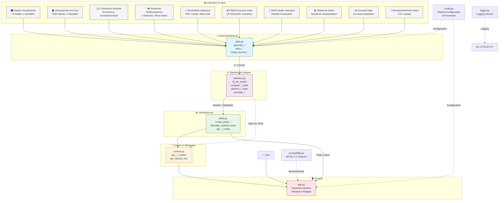

# Linear Regression Guide

[](https://www.python.org/downloads/)
[](https://opensource.org/licenses/MIT)
[](https://streamlit.io)
[](https://github.com/lhagenmayer/linear-regression-guide/actions)
[](https://codecov.io/gh/lhagenmayer/linear-regression-guide)

Eine interaktive Web-App zum Erlernen linearer Regression mit Streamlit, plotly und statsmodels.

## Los geht's

**Voraussetzungen:**
- Python 3.9 oder neuer
- Ein virtuelles Environment (empfohlen)

**Installation:**
```bash
# Repository klonen
git clone https://github.com/lhagenmayer/linear-regression-guide.git
cd linear-regression-guide

# Virtuelle Umgebung erstellen (empfohlen)
python -m venv venv
source venv/bin/activate  # Auf Windows: venv\Scripts\activate

# Abhängigkeiten installieren
pip install -r requirements.txt

# App starten
streamlit run run.py
```

**Alternative Installation (Development):**
```bash
# Für Entwickler mit allen Abhängigkeiten
pip install -r requirements-dev.txt
```

Die App öffnet sich automatisch im Browser.

## Features

- Interaktive Visualisierungen mit Plotly
- Einfache lineare Regression mit Schritt-für-Schritt Erklärung
- Mehrfachregression mit mehreren Variablen
- Integration mit Schweizer Open Government Data
- Barrierefreiheit (WCAG 2.1 konform)
- Automatisierte Tests und CI/CD Pipeline

## Architektur & Dataflow

### 📊 Dataflow: Von Datensets bis zur UI



### 🔄 Detaillierter Datenfluss

1. **Input Layer**: 10 verschiedene Datensets
   - 🏙️ Städte-Umsatzstudie (75 Städte, multiple Regression)
   - 🏠 Häuserpreise mit Pool (1000 Häuser, 4 Variablen)
   - 🇨🇭 Schweizer Kantone (26 Kantone, sozioökonomisch)
   - 🌤️ Schweizer Wetterstationen (7 Stationen, Klima-Daten)
   - 🏦 World Bank (200+ Länder, globale Wirtschaft)
   - 💰 FRED (US Wirtschaft, Zeitreihen)
   - 🏥 WHO (globale Gesundheitsdaten)
   - 💻 Elektronik-Markt (simulierte Verkaufsdaten)
   - 📊 Eurostat (EU-weite Statistiken)
   - 📄 Benutzerdefinierte Daten (CSV Upload)

2. **Data Processing**: `data.py` transformiert Rohdaten in X/y Arrays für Regression
3. **Statistical Analysis**: `statistics.py` führt OLS-Regression, Tests und Diagnostik durch
4. **Visualization**: `plots.py` erstellt interaktive Plotly-Charts und Residuen-Analysen
5. **Content**: `content.py` generiert erklärende Texte und Metadaten
6. **UI Layer**: `app.py` orchestriert alles in der Streamlit-Oberfläche

### 📈 Modell-Architektur

Die Anwendung folgt einer **streng modularen Architektur** mit klarer Trennung der Zuständigkeiten:

- **`data.py`** (16 Funktionen): **Nur Daten-Generierung & -Verarbeitung**
  - Simulierte Datensätze (`generate_*`)
  - API-Integration (`fetch_*`)
  - Datenvalidierung (`safe_*`, `create_dummy_*`)

- **`statistics.py`** (20 Funktionen): **Nur statistische Berechnungen**
  - OLS-Modelle (`fit_*`, `compute_*`)
  - Diagnostik (`perform_*`, `calculate_*`)
  - Statistiken (`get_*`, `format_*`)

- **`plots.py`** (16 Funktionen): **Nur Visualisierung**
  - Plotly-Charts (`create_plotly*`)
  - Residuen-Plots (`calculate_residual_sizes`)
  - Layout-Konfiguration (`get_*_config`)

- **`content.py`** (4 Funktionen): **Nur Metadaten & Content**
  - Lerninhalte (`get_*_content`)
  - Beschreibungen (`get_*_descriptions`)

- **`app.py`**: **Orchestrierung** aller Module

### Modulare Architektur

Die Anwendung folgt einer **streng modularen Architektur** mit klarer Trennung der Zuständigkeiten:

- **`data.py`** (16 Funktionen): **Nur Daten-Generierung**
  - Simulierte Datensätze (generate_*)
  - API-Integration (fetch_*)
  - Datenvalidierung (safe_*)

- **`statistics.py`** (20 Funktionen): **Nur statistische Berechnungen**
  - OLS-Modelle (fit_*, compute_*)
  - Diagnostik (perform_*, calculate_*)
  - Statistiken (get_*, format_*)

- **`plots.py`** (16 Funktionen): **Nur Visualisierung**
  - Plotly-Visualisierungen (create_plotly*)
  - Residuen-Plots (calculate_residual_sizes)
  - Layout-Konfiguration (get_*_config)

- **`content.py`** (4 Funktionen): **Nur Metadaten**
  - Lerninhalte (get_*_content)
  - Beschreibungen (get_*_descriptions)

- **`app.py`**: **Orchestrierung** aller Module

## Projekt-Struktur

```
linear-regression-guide/
├── .github/workflows/      # CI/CD Pipelines
├── config/                 # Konfigurationsdateien (Black, MyPy, etc.)
├── docs/                   # Umfassende Dokumentation
├── scripts/                # Hilfsskripte für Entwicklung
│   ├── validate_architecture.py    # 🆕 Strenge Architekturvalidierung
│   └── check_modular_separation.py # 🆕 Modulare Trennung prüfen
├── src/                    # Haupt-Code
│   ├── app.py             # Haupt-Streamlit-Anwendung
│   ├── data.py            # Daten-Generierung und -Verarbeitung
│   ├── statistics.py      # 🆕 Statistische Berechnungen
│   ├── plots.py           # Visualisierungskomponenten
│   ├── accessibility.py   # Barrierefreiheits-Features
│   ├── config.py          # App-Konfiguration
│   ├── content.py         # Lerninhalte und Texte
│   └── logger.py          # Logging-Konfiguration
├── tests/                  # Umfassende Testsuite
│   ├── test_*.py          # Verschiedene Test-Arten
│   ├── test_modular_separation.py  # 🆕 Modulare Tests
│   └── conftest.py        # Test-Konfiguration
├── requirements.txt        # Produktionsabhängigkeiten
├── requirements-dev.txt    # Entwicklungsabhängigkeiten
├── run.py                 # App-Startpunkt
└── pyproject.toml         # Moderne Python-Projekt-Konfiguration
```

## Tests ausführen

```bash
# Alle Tests ausführen
pytest

# Mit Coverage-Bericht
pytest --cov=src --cov-report=html

# Nur schnelle Tests (ohne Performance-Tests)
pytest -m "not slow"

# Spezifische Test-Arten
pytest -m "unit"           # Unit-Tests
pytest -m "integration"    # Integration-Tests
pytest -m "visual"         # Visuelle Regression-Tests
```

## Beitrag leisten

Wir freuen uns über Beiträge! Bitte lesen Sie unsere [Entwicklungsrichtlinien](docs/DEVELOPMENT.md).

**Schnellstart für Entwickler:**
1. Fork das Repository
2. `git clone` Ihres Forks
3. `pip install -r requirements-dev.txt`
4. `pre-commit install` (für automatische Code-Qualität)
5. Erstellen Sie einen Feature-Branch
6. Implementieren und testen Sie Ihre Änderungen
7. Erstellen Sie einen Pull Request

## Weitere Informationen

- **[Vollständige Dokumentation](docs/README.md)** - Detaillierte Anleitung
- **[Entwicklung](docs/DEVELOPMENT.md)** - Für Mitwirkende
- **[Documentation Index](docs/INDEX.md)** - Vollständiger Leitfaden-Index
- **[Barrierefreiheit](docs/ACCESSIBILITY.md)** - WCAG 2.1 Konformität
- **[Logging](docs/LOGGING.md)** - Logging-Konfiguration

## Lizenz

MIT License - siehe [LICENSE](LICENSE) für Details.