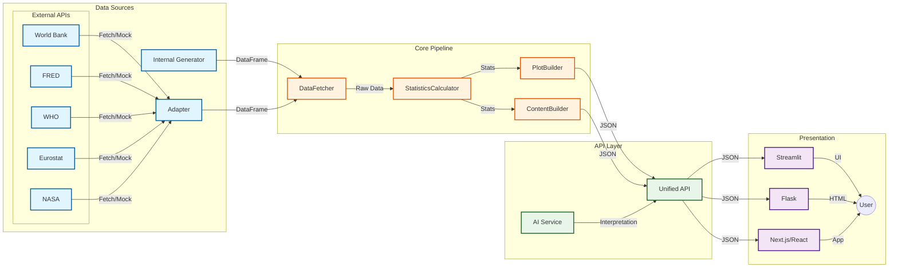

# 📊 Regression Analysis

**Interactive Statistical Learning Platform - 100% Platform Agnostic**

Eine moderne Lernplattform für Regressionsanalyse mit **vollständig plattform-agnostischer Architektur**.

Funktioniert mit **JEDEM Frontend**: Next.js, Vite, Vue, Angular, Flask, Streamlit, Mobile Apps.


---

## ✨ Features

### 🔌 100% Plattform-Agnostisch

Diese Anwendung bietet eine **reine REST API**, die von jedem Frontend konsumiert werden kann:

| Frontend | Unterstützt |
|----------|-------------|
| Next.js / React | ✅ |
| Vite / Vue.js | ✅ |
| Angular | ✅ |
| Svelte | ✅ |
| Mobile Apps (iOS/Android) | ✅ |
| Flask (HTML) | ✅ |
| Streamlit | ✅ |
| Jeder HTTP-Client | ✅ |

### 📈 Einfache Regression (11 Kapitel)
- Mehrdimensionale Verteilungen & bivariate Normalverteilung
- Kovarianz, Korrelation (Pearson & Spearman)
- OLS-Schätzung mit Residuenanalyse
- Gauss-Markov Annahmen & Diagnostik
- t-Tests, F-Tests, ANOVA
- Heteroskedastizität & robuste Standardfehler

### 📊 Multiple Regression (9 Kapitel)
- OLS in Matrixnotation
- Partielle vs. totale Effekte
- Multikollinearität & VIF
- Dummy-Variablen
- Residuendiagnostik
- 3D-Regressionsebene

### 🤖 AI Integration (Perplexity)
- Gesamtheitliche Interpretation des R-Outputs
- Erklärt ALLE statistischen Werte verständlich
- Fallback-Interpretation ohne API-Key
- Response-Caching

---

## 🚀 Quick Start

### Installation

```bash
git clone <repository-url>
cd regression-analysis
pip install -r requirements.txt
```

### Ausführung

```bash
# Option 1: REST API (für externe Frontends: Next.js, Vite, etc.)
python3 run.py --api --port 8000

# Option 2: Flask Web App (Server-Rendered HTML)
python3 run.py --flask --port 5000

# Option 3: Streamlit (Interactive Python UI)
streamlit run run.py
```

### URLs

| Modus | URL | Beschreibung |
|-------|-----|--------------|
| REST API | http://localhost:8000 | JSON API für externe Frontends |
| Flask | http://localhost:5000 | Server-Rendered HTML |
| Streamlit | http://localhost:8501 | Interactive Python UI |

---

## 📚 API Dokumentation

### Interaktive Dokumentation

Nach dem Start des API-Servers sind folgende Dokumentations-Seiten verfügbar:

| URL | Beschreibung |
|-----|--------------|
| [/api/docs](http://localhost:8000/api/docs) | **📖 Swagger UI** - Interaktive API-Dokumentation mit "Try it out" |
| [/api/redoc](http://localhost:8000/api/redoc) | **📕 ReDoc** - Alternative, übersichtliche Dokumentation |
| [/api/openapi.json](http://localhost:8000/api/openapi.json) | **📄 OpenAPI 3.0** - JSON Specification |
| [/api/openapi.yaml](http://localhost:8000/api/openapi.yaml) | **📄 OpenAPI 3.0** - YAML Specification |

**Vollständige API-Dokumentation: [docs/API.md](docs/API.md)**

### Endpoints Übersicht

| Method | Endpoint | Beschreibung |
|--------|----------|--------------|
| `POST` | `/api/regression/simple` | Simple Regression ausführen |
| `POST` | `/api/regression/multiple` | Multiple Regression ausführen |
| `POST` | `/api/content/simple` | Educational Content (Simple) |
| `POST` | `/api/content/multiple` | Educational Content (Multiple) |
| `GET` | `/api/content/schema` | Content-Schema |
| `POST` | `/api/ai/interpret` | AI Interpretation |
| `POST` | `/api/ai/r-output` | R-Output generieren |
| `GET` | `/api/ai/status` | AI Service Status |
| `GET` | `/api/datasets` | Verfügbare Datensätze |
| `GET` | `/api/health` | Health Check |

### Beispiel: Simple Regression

```bash
curl -X POST http://localhost:8000/api/regression/simple \
  -H "Content-Type: application/json" \
  -d '{"dataset": "electronics", "n": 50}'
```

**Response:**
```json
{
  "success": true,
  "data": {
    "type": "simple",
    "stats": {
      "coefficients": { "intercept": 0.52, "slope": 0.48 },
      "model_fit": { "r_squared": 0.89, "r_squared_adj": 0.87 },
      "t_tests": { ... }
    },
    "plots": {
      "scatter": { "data": [...], "layout": {...} },
      "residuals": { ... }
    }
  }
}
```

### Beispiel: Educational Content

```bash
curl -X POST http://localhost:8000/api/content/simple \
  -H "Content-Type: application/json" \
  -d '{"dataset": "electronics", "n": 50}'
```

**Response:**
```json
{
  "success": true,
  "content": {
    "title": "📊 Einfache Lineare Regression",
    "chapters": [
      {
        "type": "chapter",
        "number": "1.0",
        "title": "Einleitung",
        "sections": [
          { "type": "markdown", "text": "..." },
          { "type": "formula", "latex": "Y = β₀ + β₁X + ε" },
          { "type": "plot", "plot_key": "scatter" }
        ]
      }
    ]
  },
  "plots": { ... },
  "stats": { ... }
}
```

---

## 🎨 Frontend Integration

### Next.js / React

```typescript
// lib/api.ts
const API_URL = 'http://localhost:8000';

export async function getContent(params: {
  dataset?: string;
  n?: number;
}) {
  const res = await fetch(`${API_URL}/api/content/simple`, {
    method: 'POST',
    headers: { 'Content-Type': 'application/json' },
    body: JSON.stringify(params),
  });
  return res.json();
}
```

```tsx
// components/RegressionChart.tsx
import dynamic from 'next/dynamic';
const Plot = dynamic(() => import('react-plotly.js'), { ssr: false });

export function Chart({ plotData }) {
  return <Plot data={plotData.data} layout={plotData.layout} />;
}
```

### Vue.js / Vite

```typescript
// composables/useRegression.ts
export function useRegression() {
  const result = ref(null);

  async function analyze(dataset = 'electronics', n = 50) {
    const res = await fetch('http://localhost:8000/api/content/simple', {
      method: 'POST',
      headers: { 'Content-Type': 'application/json' },
      body: JSON.stringify({ dataset, n }),
    });
    result.value = await res.json();
  }

  return { result, analyze };
}
```

### Vanilla JavaScript

```javascript
async function analyze() {
  const response = await fetch('http://localhost:8000/api/content/simple', {
    method: 'POST',
    headers: { 'Content-Type': 'application/json' },
    body: JSON.stringify({ dataset: 'electronics', n: 50 }),
  });
  
  const { content, plots } = await response.json();
  
  // Render plot with Plotly.js
  Plotly.newPlot('chart', plots.scatter.data, plots.scatter.layout);
  
  // Render content
  content.chapters.forEach(chapter => renderChapter(chapter));
}
```

---

## 🏗️ Architektur

### 📦 Dataflow Architecture



```
┌─────────────────────────────────────────────────────────────────────────────┐
│                              FRONTENDS                                       │
│   Next.js │ Vite │ Vue │ Angular │ Svelte │ Flask │ Streamlit │ Mobile     │
└────────────────────────────────────┬────────────────────────────────────────┘
                                     │ HTTP/JSON
                                     ↓
┌────────────────────────────────────────────────────────────────────────────┐
│                           REST API LAYER                                    │
│                          /src/api/ (Pure JSON)                              │
│   RegressionAPI │ ContentAPI │ AIInterpretationAPI │ OpenAPI                │
└────────────────────────────────────┬────────────────────────────────────────┘
                                     │
                                     ↓
┌────────────────────────────────────────────────────────────────────────────┐
│                        CORE LAYER (Pure Python)                             │
│                                                                             │
│  ┌─────────────┐    ┌─────────────┐    ┌─────────────┐                     │
│  │  Pipeline   │    │   Content   │    │     AI      │                     │
│  │ DataFetcher │    │  Builder    │    │  Perplexity │                     │
│  │ Calculator  │    │  Structure  │    │   Client    │                     │
│  │ PlotBuilder │    │  Elements   │    │             │                     │
│  └─────────────┘    └─────────────┘    └─────────────┘                     │
│                                                                             │
│               Alle Outputs sind JSON-serialisierbar                         │
└────────────────────────────────────────────────────────────────────────────┘
```

### Schlüsselprinzipien (Clean Architecture)

1. **Domain Layer ist Framework-frei**
   - `/src/core/domain/` - Pure Python, keine externen Deps
   - `/src/core/application/` - Use Cases & DTOs

2. **Infrastructure implementiert Domain-Interfaces**
   - `/src/infrastructure/` - numpy, scipy, plotly
   - Dependency Injection via `container.py`

3. **Alles JSON-serialisierbar**
   - Numpy Arrays → Listen
   - Plotly Figures → JSON
   - Content → Strukturierte Dicts

---

## 📁 Projektstruktur

```
src/
├── core/                   # 🏛️ Clean Architecture Core
│   ├── domain/             #    Pure Python Entities, VOs, Interfaces
│   │   ├── entities.py     #    RegressionModel
│   │   ├── value_objects.py#    RegressionMetrics, RegressionParameters
│   │   └── interfaces.py   #    IDataProvider, IRegressionService
│   └── application/        #    Use Cases & DTOs
│       ├── use_cases.py    #    RunRegressionUseCase
│       └── dtos.py         #    Request/Response DTOs
│
├── infrastructure/         # 🔧 Implementations
│   ├── data/               #    DataFetcher, generators
│   ├── services/           #    StatisticsCalculator, PlotBuilder
│   ├── content/            #    Educational Content Builder
│   ├── ai/                 #    Perplexity API Client
│   └── regression_pipeline.py  # 4-Step Pipeline
│
├── api/                    # 🔌 REST API
│   ├── endpoints.py        #    RegressionAPI, ContentAPI
│   └── serializers.py      #    JSON Serialization
│
├── adapters/               # 🎨 Framework Adapters
│   ├── flask_app.py        #    Flask HTML App
│   └── streamlit/          #    Streamlit Interactive UI
│
├── container.py            # 💉 Dependency Injection
└── config/                 # ⚙️ Configuration
```

---

## 📊 Content Schema

Alle Content-Elemente folgen dieser Struktur:

```typescript
interface ContentElement =
  | { type: 'markdown'; text: string }
  | { type: 'formula'; latex: string; inline?: boolean }
  | { type: 'plot'; plot_key: string; height?: number }
  | { type: 'metric'; label: string; value: string }
  | { type: 'metric_row'; metrics: Metric[] }
  | { type: 'table'; headers: string[]; rows: string[][] }
  | { type: 'expander'; title: string; content: ContentElement[] }
  | { type: 'columns'; columns: ContentElement[][] }
  | { type: 'info_box' | 'warning_box' | 'success_box'; content: string }
  | { type: 'code_block'; code: string; language?: string }
  | { type: 'divider' };
```

Mehr Details: [docs/ARCHITECTURE.md](docs/ARCHITECTURE.md)

---

## 🤖 AI Konfiguration

```bash
# Umgebungsvariable
export PERPLEXITY_API_KEY="your-api-key"

# Oder .streamlit/secrets.toml
[perplexity]
api_key = "your-api-key"
```

Ohne API-Key wird eine Fallback-Interpretation generiert.

---

## 🧪 Tests

```bash
# API testen
curl http://localhost:8000/api/health

# Pytest
pytest tests/ -v
```

---

## 📋 Requirements

```
flask>=3.0.0
streamlit>=1.28.0
numpy>=1.24.0
scipy>=1.11.0
pandas>=2.0.0
plotly>=5.18.0
requests>=2.31.0
markdown>=3.5.0
```

---

## 📄 Lizenz

MIT License - siehe [LICENSE](LICENSE)
