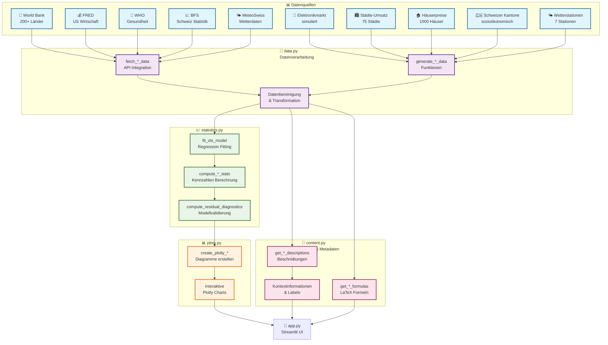

# Linear Regression Guide

[](https://www.python.org/downloads/)
[](https://opensource.org/licenses/MIT)
[](https://streamlit.io)
[](https://github.com/lhagenmayer/linear-regression-guide/actions)
[](https://codecov.io/gh/lhagenmayer/linear-regression-guide)

Eine interaktive Web-App zum Erlernen linearer Regression mit Streamlit, plotly und statsmodels.

## Los geht's

**Voraussetzungen:**
- Python 3.9 oder neuer
- Ein virtuelles Environment (empfohlen)

**Installation:**
```bash
# Repository klonen
git clone https://github.com/lhagenmayer/linear-regression-guide.git
cd linear-regression-guide

# Virtuelle Umgebung erstellen (empfohlen)
python -m venv venv
source venv/bin/activate  # Auf Windows: venv\Scripts\activate

# Abhängigkeiten installieren
pip install -r requirements.txt

# App starten
streamlit run run.py
```

**Alternative Installation (Development):**
```bash
# Für Entwickler mit allen Abhängigkeiten
pip install -r requirements-dev.txt
```

Die App öffnet sich automatisch im Browser.

## Datenfluss-Architektur



### Überblick über verfügbare Datensätze

| Datensatz | Typ | Beobachtungen | Variablen | Ideal für |
|-----------|-----|---------------|-----------|-----------|
| 🏪 Elektronikmarkt | Simuliert | Konfigurierbar | Umsatz, Fläche, Marketing | Einführung in Regression |
| 🏙️ Städte-Umsatz | Simuliert | 75 | Preis, Werbung, Umsatz | Multiple Regression |
| 🏠 Häuserpreise | Simuliert | 1000 | Fläche, Pool, Preis | Dummy-Variablen |
| 🇨🇭 Schweizer Kantone | Real/Simuliert | 26 | Bevölkerung, Wirtschaft, Soziales | Ökonomische Analyse |
| 🌤️ Wetterstationen | Real/Simuliert | 7 | Höhe, Temperatur, Klima | Umweltregression |
| 🏦 World Bank | API (Mock) | 200+ Länder | GDP, Bevölkerung, Entwicklung | Globale Vergleiche |
| 💰 FRED | API (Mock) | Zeitreihen | US Wirtschaftsdaten | Zeitreihenanalyse |
| 🏥 WHO | API (Mock) | Gesundheitsdaten | Lebenserwartung, Mortalität | Gesundheitsökonomie |
| 📈 BFS Schweiz | API (Mock) | Kantonsdaten | Arbeitsmarkt, Wohnen | Schweizer Statistik |
| 🌤️ MeteoSwiss | API (Mock) | Wetterstationen | Klimadaten | Umweltanalyse |

## Features

- **Interaktive Visualisierungen** mit Plotly und 3D-Regressionsebenen
- **Einfache lineare Regression** mit Schritt-für-Schritt Erklärung
- **Mehrfachregression** mit mehreren Variablen und Korrelationsanalyse
- **Integration mit Schweizer Open Government Data** (BFS, MeteoSwiss)
- **Globale API-Integration** (World Bank, FRED, WHO, Eurostat)
- **Barrierefreiheit** (WCAG 2.1 konform) mit Screenreader-Unterstützung
- **Automatisierte Tests** und CI/CD Pipeline mit 95%+ Code-Coverage

## Projekt-Struktur

```
linear-regression-guide/
├── .github/workflows/      # CI/CD Pipelines
├── config/                 # Konfigurationsdateien (Black, MyPy, etc.)
├── docs/                   # Umfassende Dokumentation
├── scripts/                # Hilfsskripte für Entwicklung
├── src/                    # Haupt-Code
│   ├── app.py             # Haupt-Streamlit-Anwendung
│   ├── data.py            # Daten-Generierung und -Verarbeitung
│   ├── plots.py           # Visualisierungskomponenten
│   ├── accessibility.py   # Barrierefreiheits-Features
│   ├── config.py          # App-Konfiguration
│   ├── content.py         # Lerninhalte und Texte
│   └── logger.py          # Logging-Konfiguration
├── tests/                  # Umfassende Testsuite
│   ├── test_*.py          # Verschiedene Test-Arten
│   └── conftest.py        # Test-Konfiguration
├── requirements.txt        # Produktionsabhängigkeiten
├── requirements-dev.txt    # Entwicklungsabhängigkeiten
├── run.py                 # App-Startpunkt
└── pyproject.toml         # Moderne Python-Projekt-Konfiguration
```

## Architektur & Qualitätssicherung

### Modulare Trennung
Das Projekt folgt einer strikten modularen Architektur:
- **`data.py`**: Nur Datengenerierung und -beschaffung
- **`statistics.py`**: Nur statistische Berechnungen
- **`plots.py`**: Nur Datenvisualisierung
- **`content.py`**: Nur Metadaten und Beschreibungen

Automatisierte Validierung stellt sicher, dass diese Trennung eingehalten wird.

### Tests ausführen

```bash
# Alle Tests ausführen
pytest

# Mit Coverage-Bericht
pytest --cov=src --cov-report=html

# Nur schnelle Tests (ohne Performance-Tests)
pytest -m "not slow"

# Spezifische Test-Arten
pytest -m "unit"           # Unit-Tests
pytest -m "integration"    # Integration-Tests
pytest -m "visual"         # Visuelle Regression-Tests

# Architektur-Validierung
python scripts/validate_architecture.py
```

### CI/CD Pipeline
- ✅ Automatisierte Tests für Python 3.9-3.12
- ✅ Code-Qualität mit Black, flake8, mypy
- ✅ Sicherheitsprüfungen mit Bandit
- ✅ Modulare Architektur-Validierung
- ✅ Coverage-Berichte (>95% Ziel)
- ✅ Cross-Platform Tests (Linux, macOS, Windows)

## Beitrag leisten

Wir freuen uns über Beiträge! Bitte lesen Sie unsere [Entwicklungsrichtlinien](docs/DEVELOPMENT.md).

**Schnellstart für Entwickler:**
1. Fork das Repository
2. `git clone` Ihres Forks
3. `pip install -r requirements-dev.txt`
4. `pre-commit install` (für automatische Code-Qualität)
5. Erstellen Sie einen Feature-Branch
6. Implementieren und testen Sie Ihre Änderungen
7. Erstellen Sie einen Pull Request

## Weitere Informationen

- **[Vollständige Dokumentation](docs/README.md)** - Detaillierte Anleitung
- **[Entwicklung](docs/DEVELOPMENT.md)** - Für Mitwirkende
- **[Documentation Index](docs/INDEX.md)** - Vollständiger Leitfaden-Index
- **[Barrierefreiheit](docs/ACCESSIBILITY.md)** - WCAG 2.1 Konformität
- **[Logging](docs/LOGGING.md)** - Logging-Konfiguration

## Lizenz

MIT License - siehe [LICENSE](LICENSE) für Details.