# Linear Regression Guide

[](https://www.python.org/downloads/)
[](https://opensource.org/licenses/MIT)
[](https://streamlit.io)
[](https://github.com/lhagenmayer/linear-regression-guide/actions)
[](https://codecov.io/gh/lhagenmayer/linear-regression-guide)

Eine interaktive Web-App zum Erlernen linearer Regression mit Streamlit, plotly und statsmodels.

## Los geht's

**Voraussetzungen:**
- Python 3.9 oder neuer
- Ein virtuelles Environment (empfohlen)

**Installation:**
```bash
# Repository klonen
git clone https://github.com/lhagenmayer/linear-regression-guide.git
cd linear-regression-guide

# Virtuelle Umgebung erstellen (empfohlen)
python -m venv venv
source venv/bin/activate  # Auf Windows: venv\Scripts\activate

# Abhängigkeiten installieren
pip install -r requirements.txt

# App starten
streamlit run run.py
```

**Alternative Installation (Development):**
```bash
# Für Entwickler mit allen Abhängigkeiten
pip install -r requirements-dev.txt
```

Die App öffnet sich automatisch im Browser.

## Datenfluss-Architektur

```mermaid
graph TB
    %% Define styles
    classDef dataSource fill:#e1f5fe,stroke:#01579b,stroke-width:2px
    classDef dataProcessor fill:#f3e5f5,stroke:#4a148c,stroke-width:2px
    classDef analysis fill:#e8f5e8,stroke:#1b5e20,stroke-width:2px
    classDef visualization fill:#fff3e0,stroke:#e65100,stroke-width:2px
    classDef content fill:#fce4ec,stroke:#880e4f,stroke-width:2px

    %% Data Sources
    subgraph "📊 Datenquellen"
        SIM[🪠Elektronikmarkt<br/>simuliert]
        CITIES[ğŸ™ï¸ Städte-Umsatz<br/>75 Städte]
        HOUSES[🠠Häuserpreise<br/>1000 Häuser]
        CANTONS[🇨🇭 Schweizer Kantone<br/>sozioökonomisch]
        WEATHER[ğŸŒ¤ï¸ Wetterstationen<br/>7 Stationen]
        WORLDBANK[🦠World Bank<br/>200+ Länder]
        FRED[💰 FRED<br/>US Wirtschaft]
        WHO[🥠WHO<br/>Gesundheit]
        BFS[📈 BFS<br/>Schweiz Statistik]
        METEOSWISS[ğŸŒ¤ï¸ MeteoSwiss<br/>Wetterdaten]
    end

    %% Data Processing Module
    subgraph "🔄 data.py<br/>Datenverarbeitung"
        GENERATE[generate_*_data<br/>Funktionen]
        FETCH[fetch_*_data<br/>API Integration]
        PROCESS[Datenbereinigung<br/>& Transformation]
    end

    %% Analysis Module
    subgraph "📈 statistics.py<br/>Statistische Analyse"
        OLS[fit_ols_model<br/>Regression Fitting]
        COMPUTE[compute_*_stats<br/>Kennzahlen Berechnung]
        DIAGNOSTIC[compute_residual_diagnostics<br/>Modellvalidierung]
    end

    %% Visualization Module
    subgraph "📊 plots.py<br/>Visualisierung"
        CHART[create_plotly_*<br/>Diagramme erstellen]
        INTERACTIVE[Interaktive<br/>Plotly Charts]
    end

    %% Content Module
    subgraph "📠content.py<br/>Inhalte & Metadaten"
        FORMULAS[get_*_formulas<br/>LaTeX Formeln]
        DESCRIPTIONS[get_*_descriptions<br/>Beschreibungen]
        CONTEXT[Kontextinformationen<br/>& Labels]
    end

    %% Flow connections
    SIM --> GENERATE
    CITIES --> GENERATE
    HOUSES --> GENERATE
    CANTONS --> GENERATE
    WEATHER --> GENERATE

    WORLDBANK --> FETCH
    FRED --> FETCH
    WHO --> FETCH
    BFS --> FETCH
    METEOSWISS --> FETCH

    FETCH --> PROCESS
    GENERATE --> PROCESS

    PROCESS --> OLS
    OLS --> COMPUTE
    COMPUTE --> DIAGNOSTIC

    DIAGNOSTIC --> CHART
    CHART --> INTERACTIVE

    PROCESS --> FORMULAS
    PROCESS --> DESCRIPTIONS
    DESCRIPTIONS --> CONTEXT

    INTERACTIVE --> APP[🯠app.py<br/>Streamlit UI]
    CONTEXT --> APP
    FORMULAS --> APP

    %% Apply styles
    class SIM,CITIES,HOUSES,CANTONS,WEATHER,WORLDBANK,FRED,WHO,BFS,METEOSWISS dataSource
    class GENERATE,FETCH,PROCESS dataProcessor
    class OLS,COMPUTE,DIAGNOSTIC analysis
    class CHART,INTERACTIVE visualization
    class FORMULAS,DESCRIPTIONS,CONTEXT content
```



### Überblick über verfügbare Datensätze

| Datensatz | Typ | Beobachtungen | Variablen | Ideal für |
|-----------|-----|---------------|-----------|-----------|
| 🏪 Elektronikmarkt | Simuliert | Konfigurierbar | Umsatz, Fläche, Marketing | Einführung in Regression |
| 🏙️ Städte-Umsatz | Simuliert | 75 | Preis, Werbung, Umsatz | Multiple Regression |
| 🏠 Häuserpreise | Simuliert | 1000 | Fläche, Pool, Preis | Dummy-Variablen |
| 🇨🇭 Schweizer Kantone | Real/Simuliert | 26 | Bevölkerung, Wirtschaft, Soziales | Ökonomische Analyse |
| 🌤️ Wetterstationen | Real/Simuliert | 7 | Höhe, Temperatur, Klima | Umweltregression |
| 🏦 World Bank | API (Mock) | 200+ Länder | GDP, Bevölkerung, Entwicklung | Globale Vergleiche |
| 💰 FRED | API (Mock) | Zeitreihen | US Wirtschaftsdaten | Zeitreihenanalyse |
| 🏥 WHO | API (Mock) | Gesundheitsdaten | Lebenserwartung, Mortalität | Gesundheitsökonomie |
| 📈 BFS Schweiz | API (Mock) | Kantonsdaten | Arbeitsmarkt, Wohnen | Schweizer Statistik |
| 🌤️ MeteoSwiss | API (Mock) | Wetterstationen | Klimadaten | Umweltanalyse |

## Features

- **Interaktive Visualisierungen** mit Plotly und 3D-Regressionsebenen
- **Einfache lineare Regression** mit Schritt-für-Schritt Erklärung
- **Mehrfachregression** mit mehreren Variablen und Korrelationsanalyse
- **Integration mit Schweizer Open Government Data** (BFS, MeteoSwiss)
- **Globale API-Integration** (World Bank, FRED, WHO, Eurostat)
- **Barrierefreiheit** (WCAG 2.1 konform) mit Screenreader-Unterstützung
- **Automatisierte Tests** und CI/CD Pipeline mit 95%+ Code-Coverage

## Architektur & Dataflow

### 📊 Dataflow: Von Datensets bis zur UI

```mermaid
graph TD
    %% Datensets/Input
    subgraph "📥 Datensets & Input"
        A1[🏙️ Städte-Umsatzstudie<br/>75 Städte, 3 Variablen]
        A2[🏠 Häuserpreise mit Pool<br/>1000 Häuser, 4 Variablen]
        A3[🇨🇭 Schweizer Kantone<br/>26 Kantone, sozioökonomisch]
        A4[🌤️ Schweizer Wetterstationen<br/>7 Stationen, Klima-Daten]
        A5[🏦 World Bank Indicators<br/>200+ Länder, Wirtschaft]
        A6[💰 FRED Economic Data<br/>US Wirtschaft, Zeitreihen]
        A7[🏥 WHO Health Indicators<br/>Globale Gesundheit]
        A8[💻 Elektronik-Markt<br/>Simulierte Verkaufsdaten]
        A9[📊 Eurostat Data<br/>EU-weite Statistiken]
        A10[📄 Benutzerdefinierte Daten<br/>CSV Upload]
    end

    %% Datenverarbeitung
    subgraph "🔄 Datenverarbeitung"
        B1[data.py<br/>generate_*<br/>fetch_*<br/>create_dummy_*]
    end

    A1 --> B1
    A2 --> B1
    A3 --> B1
    A4 --> B1
    A5 --> B1
    A6 --> B1
    A7 --> B1
    A8 --> B1
    A9 --> B1
    A10 --> B1

    %% Statistische Analyse
    subgraph "📈 Statistische Analyse"
        C1[statistics.py<br/>fit_ols_model<br/>compute_*_stats<br/>perform_*_tests<br/>calculate_*]
    end

    B1 -->|X, y Arrays| C1

    %% Visualisierung
    subgraph "📊 Visualisierung"
        D1[plots.py<br/>create_plotly_*<br/>calculate_residual_sizes<br/>get_*_config]
    end

    C1 -->|Modell + Statistiken| D1

    %% Content & Metadaten
    subgraph "📝 Content & Metadaten"
        E1[content.py<br/>get_*_content<br/>get_dataset_info]
    end

    D1 --> E1
    C1 -.->|Stats für Texte| E1

    %% UI Layer
    subgraph "🖥️ UI Layer"
        F1[app.py<br/>Streamlit Interface<br/>Interaktive Widgets]
    end

    E1 --> F1
    D1 -->|Plotly Charts| F1

    %% User
    G1[👤 User] --> F1

    %% Konfiguration & Services
    H1[config.py<br/>Dataset-Konfiguration<br/>UI-Parameter]
    I1[logger.py<br/>Logging Service]
    J1[accessibility.py<br/>WCAG 2.1 Features]

    H1 -.->|Konfiguration| B1
    H1 -.->|Konfiguration| F1
    I1 -.->|Logging| B1,C1,D1,E1,F1
    J1 -.->|Barrierefreiheit| F1

    %% Styling
    style B1 fill:#e1f5fe,stroke:#01579b
    style C1 fill:#f3e5f5,stroke:#4a148c
    style D1 fill:#e8f5e8,stroke:#1b5e20
    style E1 fill:#fff3e0,stroke:#e65100
    style F1 fill:#fce4ec,stroke:#880e4f
    style A1 fill:#f5f5f5,stroke:#424242
    style A2 fill:#f5f5f5,stroke:#424242
    style A3 fill:#f5f5f5,stroke:#424242
    style A4 fill:#f5f5f5,stroke:#424242
    style A5 fill:#f5f5f5,stroke:#424242
    style A6 fill:#f5f5f5,stroke:#424242
    style A7 fill:#f5f5f5,stroke:#424242
    style A8 fill:#f5f5f5,stroke:#424242
    style A9 fill:#f5f5f5,stroke:#424242
    style A10 fill:#f5f5f5,stroke:#424242
```



### 🔄 Detaillierter Datenfluss

1. **Input Layer**: 10 verschiedene Datensets
   - 🏙️ Städte-Umsatzstudie (75 Städte, multiple Regression)
   - 🏠 Häuserpreise mit Pool (1000 Häuser, 4 Variablen)
   - 🇨🇭 Schweizer Kantone (26 Kantone, sozioökonomisch)
   - 🌤️ Schweizer Wetterstationen (7 Stationen, Klima-Daten)
   - 🏦 World Bank (200+ Länder, globale Wirtschaft)
   - 💰 FRED (US Wirtschaft, Zeitreihen)
   - 🏥 WHO (globale Gesundheitsdaten)
   - 💻 Elektronik-Markt (simulierte Verkaufsdaten)
   - 📊 Eurostat (EU-weite Statistiken)
   - 📄 Benutzerdefinierte Daten (CSV Upload)

2. **Data Processing**: `data.py` transformiert Rohdaten in X/y Arrays für Regression
3. **Statistical Analysis**: `statistics.py` führt OLS-Regression, Tests und Diagnostik durch
4. **Visualization**: `plots.py` erstellt interaktive Plotly-Charts und Residuen-Analysen
5. **Content**: `content.py` generiert erklärende Texte und Metadaten
6. **UI Layer**: `app.py` orchestriert alles in der Streamlit-Oberfläche

### 📈 Modell-Architektur

Die Anwendung folgt einer **streng modularen Architektur** mit klarer Trennung der Zuständigkeiten:

- **`data.py`** (16 Funktionen): **Nur Daten-Generierung & -Verarbeitung**
  - Simulierte Datensätze (`generate_*`)
  - API-Integration (`fetch_*`)
  - Datenvalidierung (`safe_*`, `create_dummy_*`)

- **`statistics.py`** (20 Funktionen): **Nur statistische Berechnungen**
  - OLS-Modelle (`fit_*`, `compute_*`)
  - Diagnostik (`perform_*`, `calculate_*`)
  - Statistiken (`get_*`, `format_*`)

- **`plots.py`** (16 Funktionen): **Nur Visualisierung**
  - Plotly-Charts (`create_plotly*`)
  - Residuen-Plots (`calculate_residual_sizes`)
  - Layout-Konfiguration (`get_*_config`)

- **`content.py`** (4 Funktionen): **Nur Metadaten & Content**
  - Lerninhalte (`get_*_content`)
  - Beschreibungen (`get_*_descriptions`)

- **`app.py`**: **Orchestrierung** aller Module

### Modulare Architektur

Die Anwendung folgt einer **streng modularen Architektur** mit klarer Trennung der Zuständigkeiten:

- **`data.py`** (16 Funktionen): **Nur Daten-Generierung**
  - Simulierte Datensätze (generate_*)
  - API-Integration (fetch_*)
  - Datenvalidierung (safe_*)

- **`statistics.py`** (20 Funktionen): **Nur statistische Berechnungen**
  - OLS-Modelle (fit_*, compute_*)
  - Diagnostik (perform_*, calculate_*)
  - Statistiken (get_*, format_*)

- **`plots.py`** (16 Funktionen): **Nur Visualisierung**
  - Plotly-Visualisierungen (create_plotly*)
  - Residuen-Plots (calculate_residual_sizes)
  - Layout-Konfiguration (get_*_config)

- **`content.py`** (4 Funktionen): **Nur Metadaten**
  - Lerninhalte (get_*_content)
  - Beschreibungen (get_*_descriptions)

- **`app.py`**: **Orchestrierung** aller Module

## Projekt-Struktur

```
linear-regression-guide/
├── .github/workflows/      # CI/CD Pipelines
├── config/                 # Konfigurationsdateien (Black, MyPy, etc.)
├── docs/                   # Umfassende Dokumentation
│   ├── REFACTORING.md     # 🆕 Refactoring-Dokumentation
│   └── REFACTORING_SUMMARY.md # 🆕 Refactoring-Zusammenfassung
├── scripts/                # Hilfsskripte für Entwicklung
│   ├── validate_architecture.py    # Strenge Architekturvalidierung
│   └── check_modular_separation.py # Modulare Trennung prüfen
├── src/                    # Haupt-Code
│   ├── app.py             # 🆕 Haupt-Orchestrator (297 Zeilen, war 5,284)
│   ├── data_loading.py    # 🆕 Datenladen und Modellberechnung
│   ├── tabs/              # 🆕 Modulare Tab-Komponenten
│   │   ├── simple_regression.py   # Einfache Regression Tab
│   │   ├── multiple_regression.py # Multiple Regression Tab
│   │   └── datasets.py            # Datensätze-Übersicht Tab
│   ├── sidebar.py         # Sidebar-Komponenten
│   ├── session_state.py   # Session State Management
│   ├── data.py            # Daten-Generierung und -Verarbeitung
│   ├── statistics.py      # Statistische Berechnungen
│   ├── plots.py           # Visualisierungskomponenten
│   ├── accessibility.py   # Barrierefreiheits-Features
│   ├── config.py          # App-Konfiguration
│   ├── content.py         # Lerninhalte und Texte
│   └── logger.py          # Logging-Konfiguration
├── tests/                  # Umfassende Testsuite
│   ├── test_*.py          # Verschiedene Test-Arten
│   ├── test_modular_separation.py  # Modulare Tests
│   └── conftest.py        # Test-Konfiguration
├── requirements.txt        # Produktionsabhängigkeiten
├── requirements-dev.txt    # Entwicklungsabhängigkeiten
├── run.py                 # App-Startpunkt
└── pyproject.toml         # Moderne Python-Projekt-Konfiguration
```

## Architektur & Qualitätssicherung

### 🎯 Refactored Modular Architecture
Die App wurde kürzlich refaktorisiert für bessere Wartbarkeit:
- **`app.py`**: Schlanker Orchestrator (297 Zeilen, war 5,284 - **94% Reduktion!**)
- **`data_loading.py`**: Zentralisierte Datenladung und Model-Caching
- **`tabs/`**: Separate Module für jeden Tab
  - `simple_regression.py`: Einfache Regression
  - `multiple_regression.py`: Multiple Regression  
  - `datasets.py`: Datensätze-Übersicht
- **`sidebar.py`**: Parameter-Konfiguration
- **`session_state.py`**: Session State Management

Siehe [REFACTORING.md](docs/REFACTORING.md) für Details.

### Modulare Trennung
Das Projekt folgt einer strikten modularen Architektur:
- **`data.py`**: Nur Datengenerierung und -beschaffung
- **`statistics.py`**: Nur statistische Berechnungen
- **`plots.py`**: Nur Datenvisualisierung
- **`content.py`**: Nur Metadaten und Beschreibungen

Automatisierte Validierung stellt sicher, dass diese Trennung eingehalten wird.

### Tests ausführen

```bash
# Alle Tests ausführen
pytest

# Mit Coverage-Bericht
pytest --cov=src --cov-report=html

# Nur schnelle Tests (ohne Performance-Tests)
pytest -m "not slow"

# Spezifische Test-Arten
pytest -m "unit"           # Unit-Tests
pytest -m "integration"    # Integration-Tests
pytest -m "visual"         # Visuelle Regression-Tests

# Architektur-Validierung
python scripts/validate_architecture.py
```

### CI/CD Pipeline
- ✅ Automatisierte Tests für Python 3.9-3.12
- ✅ Code-Qualität mit Black, flake8, mypy
- ✅ Sicherheitsprüfungen mit Bandit
- ✅ Modulare Architektur-Validierung
- ✅ Coverage-Berichte (>95% Ziel)
- ✅ Cross-Platform Tests (Linux, macOS, Windows)

## Beitrag leisten

Wir freuen uns über Beiträge! Bitte lesen Sie unsere [Entwicklungsrichtlinien](docs/DEVELOPMENT.md).

**Schnellstart für Entwickler:**
1. Fork das Repository
2. `git clone` Ihres Forks
3. `pip install -r requirements-dev.txt`
4. `pre-commit install` (für automatische Code-Qualität)
5. Erstellen Sie einen Feature-Branch
6. Implementieren und testen Sie Ihre Änderungen
7. Erstellen Sie einen Pull Request

## Weitere Informationen

- **[Vollständige Dokumentation](docs/README.md)** - Detaillierte Anleitung
- **[Entwicklung](docs/DEVELOPMENT.md)** - Für Mitwirkende
- **[Documentation Index](docs/INDEX.md)** - Vollständiger Leitfaden-Index
- **[Barrierefreiheit](docs/ACCESSIBILITY.md)** - WCAG 2.1 Konformität
- **[Logging](docs/LOGGING.md)** - Logging-Konfiguration

## Lizenz

MIT License - siehe [LICENSE](LICENSE) für Details.