# Machine Learning 1 - Ausführliches Skript
## Fundamentals: Motivation, Workflow, KNN und Regression

---

## 📋 Inhaltsverzeichnis

1. [Motivation für Künstliche Intelligenz](#1-motivation-für-künstliche-intelligenz)
2. [Grundkonzepte des Machine Learning](#2-grundkonzepte-des-machine-learning)
3. [Historischer Abriss der KI](#3-historischer-abriss-der-ki)
4. [Machine Learning Lerntypen](#4-machine-learning-lerntypen)
5. [Der ML-Workflow](#5-der-ml-workflow)
6. [Daten: Kernkomponente jedes Modells](#6-daten-kernkomponente-jedes-modells)
7. [Train/Validation/Test Split](#7-trainvalidationtest-split)
8. [K-Fold Cross-Validation](#8-k-fold-cross-validation)
9. [Datenexploration und Feature Engineering](#9-datenexploration-und-feature-engineering)
10. [K-Nearest Neighbors (KNN)
Klassifizierung](#10-k-nearest-neighbors-knn-klassifizierung)
11. [Daten-Skalierung](#11-daten-skalierung)
12. [Lineare Regression](#12-lineare-regression)
13. [Logistische Regression und
Entscheidungsgrenzen](#13-logistische-regression-und-entscheidungsgrenzen)

---

## 1. Motivation für Künstliche Intelligenz

### 1.1 Warum brauchen wir AI/ML?

**Kernidee:** Machine Learning hilft uns, **praktische Probleme zu lösen**, die zu komplex
sind, um sie explizit zu programmieren.

**Beispiel 1: Turbinen-Vorhersage**
- **Problem:** Turbinen in Wasserkraftwerken fallen nach 5-10 Jahren aus
- **Warum lösen?** Der ungeplante Austausch ist sehr teuer
- **ML-Lösung:** Modell trainieren, das vorhersagt, **wann** ein Ausfall eintritt
- **Ergebnis:** Geplanter Austausch statt Notfall

**Beispiel 2: Schnelle medizinische Diagnose**
- **Problem:** Troponin-Messung im Blut dauert etwa 1 Stunde
- **Warum lösen?** Schnelle Erkennung könnte Leben retten
- **ML-Lösung:** Modell trainieren, das die Troponin-Konzentration vorhersagt
- **Ergebnis:** Schnellere Diagnose möglich

### 1.2 Das Grundprinzip: Lernen aus Mustern

**Definition:** AI/ML funktioniert immer nach demselben Prinzip:
1. Vorhandene Muster in historischen Daten **erkennen**
2. Diese Muster auf **neue, ähnliche Situationen** übertragen
3. **Vorhersagen** für die Zukunft treffen

**Metapher:** Ein Arzt sieht viele Patienten mit ähnlichen Symptomen,
lernt Muster (dieses Symptom bedeutet meist X), und kann dann bei neuen Patienten besser
diagnostizieren.

### 1.3 Ausgabeformate von AI-Modellen

Ein trainiertes Modell kann verschiedene Ausgaben produzieren:

**Qualitative Ausgabe (Kategorie):**
- *Input:* Ein Foto
- *Output:* "Dieser Hund ist mit 95% Wahrscheinlichkeit ein Bernhardiner"

**Quantitative Ausgabe (Zahl):**
- *Input:* Alter 65, Blutzucker 160 mg/dL
- *Output:* "90% Wahrscheinlichkeit für Diabetes"

### 1.4 Essenzielle Voraussetzungen

**Ohne Daten kein Modell!** Das ist absolute Voraussetzung.

**Warum?** Auch wenn wir ein Modell bauen können, ohne dass es programmiert ist:
- Das Modell **trainieren** wir, statt es zu programmieren
- Ein Rezept benötigt Zutaten und deren Verhältnisse
- Ein ML-Modell benötigt Beispieldaten

**Wichtig:** Die Trainingsdaten müssen **ähnlich** zu den Daten sein, auf die das Modell
später angewendet wird.

**Gegenbeispiel:** Ein Bildklassifizierer trainiert auf Schweißnähte in speziellen
Industriekameras funktioniert nicht für Kreditbonitätsbewertung.

---

## 2. Grundkonzepte des Machine Learning

### 2.1 Was ist Machine Learning genau?

**Definition (Arthur Samuel, 1959):**
> "The field of study that gives computers the ability to learn without being explicitly
programmed"

**Praktisch bedeutet das:**
- Computer lernen von Beispielen (Daten)
- Statt festcodierte Regeln → Der Algorithmus findet Regeln
- Nach ausreichend vielen Beispielen: Generalisierung auf neue Fälle

**Beispiel - Bildklassifizierung:**
- Wir zeigen dem Modell 10.000 markierte Bilder (Hund ja/nein)
- Das Modell lernt: "Welche Merkmale = Hund?"
- Bei neuen Bildern: Anwendung der gelernten Regeln

**Beispiel - Textgenerierung:**
- Modell liest 5 Millionen Bücher
- Lernt: "Nach dem Wort 'Guten' kommt häufig 'Morgen'"
- Kann jetzt Sätze fortsetzen: "Der Himmel ist..." → "blau"

### 2.2 Machine Learning vs. Statistik

Machine Learning **baut auf** statistischen Methoden auf, erweitert sie aber:

| Aspekt | Statistik | Machine Learning |
|--------|-----------|------------------|
| Fokus | Inferenz (Rückschlüsse) | Vorhersage |
| Ziel | p-Werte, Konfidenzintervalle | Genauigkeit auf neuen Daten |
| Fragestellung | Ist dieser Effekt signifikant? | Kann ich Zukunft vorhersagen? |

### 2.3 Disziplinen die ML bilden

Machine Learning ist ein **Schnittfeld** mehrerer Disziplinen:

```
Statistik + Mathematik + Informatik = Machine Learning
     +                      +
  Ökonomie/Psychologie      GPU-Computing
     +                      +
  Neurowissenschaften    Software Engineering
```

**Statistik:** Rückschlüsse aus Daten, Unsicherheitsquantifizierung
**Mathematik:** Optimierungsalgorithmen, Lineare Algebra
**Informatik:** Datenstrukturen, Algorithmen, große Datenmengen
**Ökonomie:** Wie optimiert ein System seine Performance?
**Neurowissenschaften:** Inspiration für Neural Networks

---

## 3. Historischer Abriss der KI

### 3.1 Zeitstrahl der KI-Entwicklung

#### 1941-1950er: Anfänge
- **1941:** Z3 - erster digitaler Computer
- **1950:** Alan Turing's Frage: "Can machines think?"
- **Grundlagen:** Logik + Informationstheorie = "Cybernetics"

#### 1956: Dartmouth Workshop - Geburt der KI
- 6-wöchiger Workshop mit führenden Forschern
  - Marvin Minsky
  - John McCarthy
  - Claude Shannon
  - …und andere
- **Erste Zieldefinition der KI:**
> "Schreibe ein Programm, das intellektuelle Probleme lösen kann, ebenso gut oder besser
als ein Mensch"

#### 1958: Das Perceptron
- Erste praktische Implementierung eines neuronalen Netzwerks
- **Physisches Gerät** mit manuell einstellbaren Gewichten
- Konnte viele Probleme lösen → Große Hoffnungen!

#### 1969: AI Winter Beginn
- **Buch:** "Perceptrons" (Minsky & Papert)
- **Erkenntnis:** ANNs können das XOR-Problem nicht lösen
- **Folge:** Fördermittel versiegen, Forschung stagniert
- **Problem (Moravecs Paradoxon):** 
  - ANNs können explizite Probleme lösen
  - Aber: Sie können nicht **sehen** oder **hören**

#### 1980er: Expert Systems und 2. AI Winter
- **Kurzfristige Renaissance:** Expertensysteme mit vorprogrammierten Regeln
- **Problem:** Limited applicability, keine Lernfähigkeit
- **Folge:** Wieder Stagnation

#### 1986: Backpropagation "wiederentdeckt"
- Rumelhart et al. zeigen: **ANNs können trainiert werden!**
- Neue Methode: Backpropagation (Gradient Descent)
- Langsamer Aufschwung beginnt

#### 1990er-2000er: Langsame Fortschritte
- **DeepBlue** (1997): Schach-Engine besiegt Gary Kasparov
- **Watson** (2011): Gewinnt Jeopardy gegen Champions
- Beginn: GPU-Computing macht alles schneller

#### 2012: AlexNet - Das Breakthrough
- **Convolutional Neural Network** (CNN) auf **2 GPUs**
- ImageNet Challenge: **Dramatischer Sprung** in Genauigkeit
- Ursachen:
  1. GPUs machen Training effizient
  2. Massive Datenmengen verfügbar (Internet)
  
#### 2010er: Deep Learning Dominanz
- Tiefe neuronale Netzwerke übertreffen fast alle anderen ML-Methoden
- Zwei kritische Faktoren:
  1. **GPU-Training:** 10-100x schneller
  2. **Datenverfügbarkeit:** Big Data überall

#### 2017: Transformer-Architektur
- **Paper:** "Attention is all you need" (Vaswani et al.)
- **Auswirkung:** Grundlage für GPT, BERT, große Sprachmodelle
- **Aktuelle Ära:** Generative AI beginnt

### Neural Network Architecture

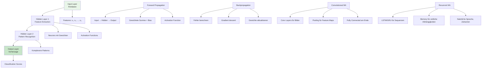

---

## 4. Machine Learning Lerntypen

### 4.1 Systematische Kategorisierung

ML wird nach **zwei Dimensionen** kategorisiert:

#### Dimension 1: Zielgröße-Typ

**Kontinuierliche Zielgröße** (Regression):
- Output: Beliebige Zahlenwerte
- Beispiele: Preis, Temperatur, Wahrscheinlichkeit
- Formel: $y \in \mathbb{R}$ (alle reellen Zahlen)

**Kategorische Zielgröße** (Klassifizierung):
- Output: Diskrete Kategorien/Klassen
- Beispiele: Hund/Katze, Spam/Kein Spam, Obstsorte
- Formel: $y \in \{C_1, C_2, \ldots, C_n\}$

#### Dimension 2: Verfügbarkeit von Labels

**Überwachtes Lernen (Supervised):**
- Trainigsdaten haben **Labels** (y-Werte)
- Beispiel: 1000 Bilder mit Markierung "Katze" oder "Nicht-Katze"
- Unser Fokus in diesem Kurs

**Unüberwachtes Lernen (Unsupervised):**
- Trainigsdaten haben **keine Labels**
- Ziel: Struktur in Daten finden
- Beispiele:
  - **Clustering:** Ähnliche Kunden gruppieren
  - **Outlier Detection:** Anomalien in Serverlogs finden

**Reinforcement Learning (mit Feedback):**
- Agent lernt durch Trial-and-Error
- Feedback: "Belohnung" oder "Bestrafung"
- Beispiel: AlphaGo lernt Go durch Millionen Spiele

### 4.2 ML-Typen Matrix

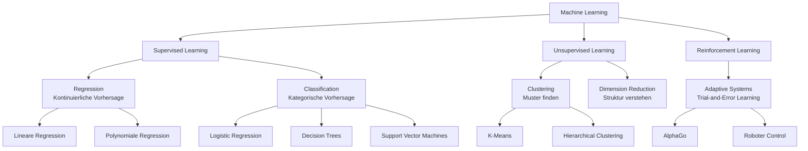

| Aufgabe | Kontinuierliche Zielgröße | Kategorische Zielgröße |
|---------|---------------------------|-------------------------|
| Vorhersagen | Regression | Klassifizierung |
| Verstehen/Erklären | Regression | Klassifizierung |
| Muster finden | Clustering | Clustering |
| Adaptiv handeln | Reinforcement Learning | Reinforcement Learning |

---

## 5. Der ML-Workflow

### 5.1 Die 3 Kernphasen

Jedes ML-Projekt folgt diesem Muster:

#### Phase 1: Representation (Darstellung)
**Entscheidungen:**
- Welche **Features** sollen wir verwenden?
  - Input: Rohbilder (Pixel)? Vorverarbeitete Features?
  - Welche 4 Messungen charakterisieren einen Apfel?
- Welchen **Klassifizierer-Typ** sollen wir wählen?
  - KNN? Decision Tree? Linear? Neural Network?

**Beispiel - Obstklassifizierung:**
- Features: height, width, mass, color_score
- Klassifizierer: k-Nearest Neighbors

#### Phase 2: Evaluation (Bewertung)
**Entscheidungen:**
- Welches **Gütemaß** ist geeignet?
  - Accuracy? Precision? Recall? F1-Score?
- Wodurch unterscheiden sich gute vs. schlechte Klassifizierer?
  - Trainigsfehler vs. Testfehler
  - Generalisierungsfähigkeit

#### Phase 3: Optimization (Optimierung)
**Entscheidungen:**
- Wie finde ich die **besten Parameter**?
  - Welcher k-Wert für KNN? (k=1, 3, 5, 10, …?)
  - Hyperparameter Tuning

### 5.2 Der iterative Zyklus

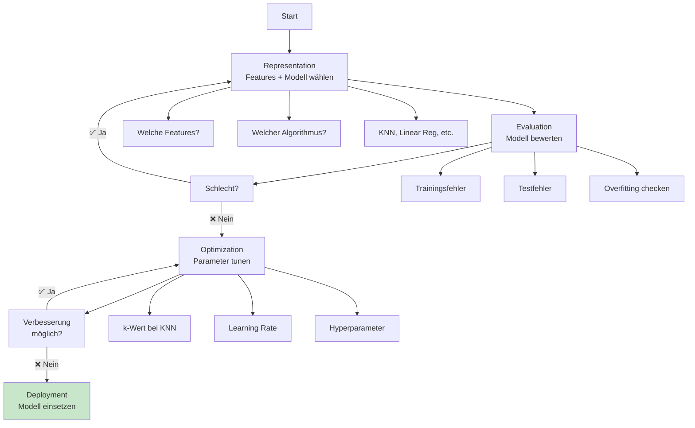

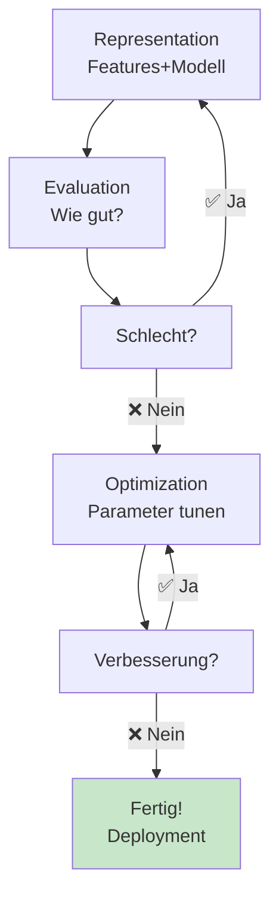

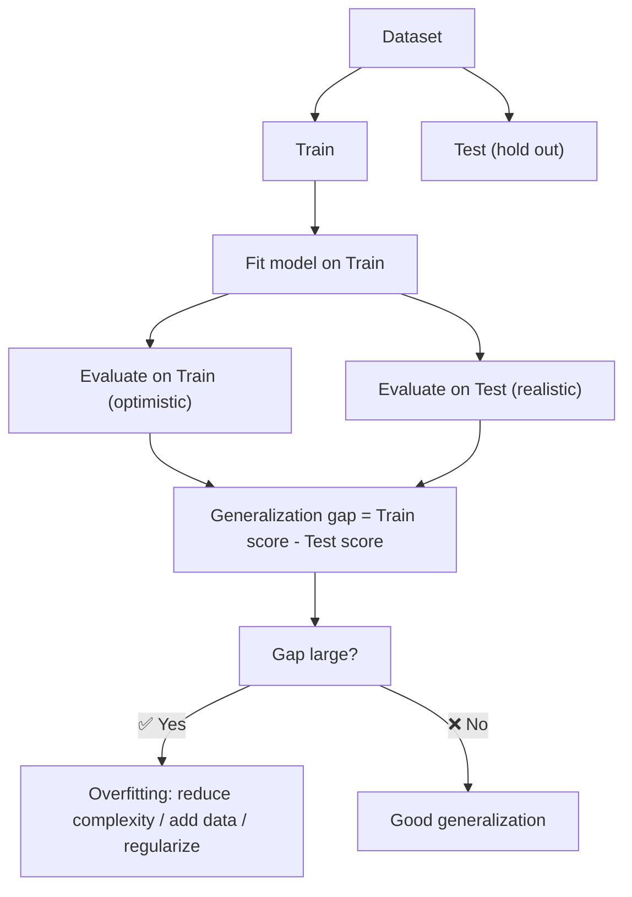

---

## 6. Daten: Kernkomponente jedes Modells

### 6.1 Der Datenfluss

**Universelle Wahrheit:** Kein Modell ohne Daten!

```
      Rohdaten
         │
         ▼
   Datenbereinigung
   (Fehler entfernen)
         │
         ▼
   Feature Engineering
   (Merkmale auswählen)
         │
         ▼
   Trainigsdaten
   (für das Modell)
         │
         ▼
   Trainiertes Modell
         │
         ▼
   Vorhersagen auf neuen Daten
```

### 6.2 Datenmodalitäten

Die gleichen ML-Konzepte funktionieren auf verschiedenen **Datentypen**:

| Datentyp | Aufgaben |
|----------|----------|
| **Bilder** | Classification, Object Detection, Segmentation |
| **Tabellen (Zahlen)** | Regression, Classification, Clustering |
| **Text** | Classification, Language Translation, Text Generation |
| **Audio** | Speech-to-Text, Speaker Identification, Text-to-Speech |
| **Zeitserien** | Vorhersage (z.B. Aktienkurs) |

### 6.3 Kritische Anforderung: Datenähnlichkeit

**Goldene Regel:**

> Trainingsdaten und zukünftige Vorhersagedaten **müssen aus der gleichen Domäne**
stammen!

**Gegenbeispiele (Funktioniert NICHT):**

| Training | Test | Problem |
|----------|------|---------|
| Bilder von Schweißnähten (Industrie) | Bilder von Obst | Völlig andere Domäne |
| Schwarzweiß-Handswritten Digits | Farbige Fotos von Ziffern | Unterschiedliche Modalität
|
| Text auf Englisch | Text auf Chinesisch | Verschiedene Sprachen |

**Problem mit zu wenig Daten:**

Wenn Sie nur wenige Daten haben:
1. **Typisch:** Kein Modell möglich
2. **Ausnahme:** Transfer Learning
   - Ein vortrainiertes Modell auf ähnlichen Daten nutzen
- Beispiel: Modell trainiert auf 1 Million Dog-Bildern → Anpassen auf 100
Bernhardiner-Bilder
   - **Wichtig:** Die Ähnlichkeit muss sehr hoch sein (z.B. auch Hunde)
   - Funktioniert **nicht** für: Finnisch nach Englisch, oder Radar-Bilder nach RGB-Bilder

---

## 7. Train/Validation/Test Split

### 7.1 Warum 3 Splits brauchen?

**Naives Vorgehen:** 1 Dataset → Trainigsfehler messen
**Problem:** Wir **cheaten** unbewusst!

Wenn wir auf den gleichen Daten trainieren und testen, kommen wir zu **optimistischen
Fehlerschätzungen**.

**Konzept: Simulation von "unsichtbaren Daten"**

Wir teilen unser Dataset in 3 disjunkte Teile:

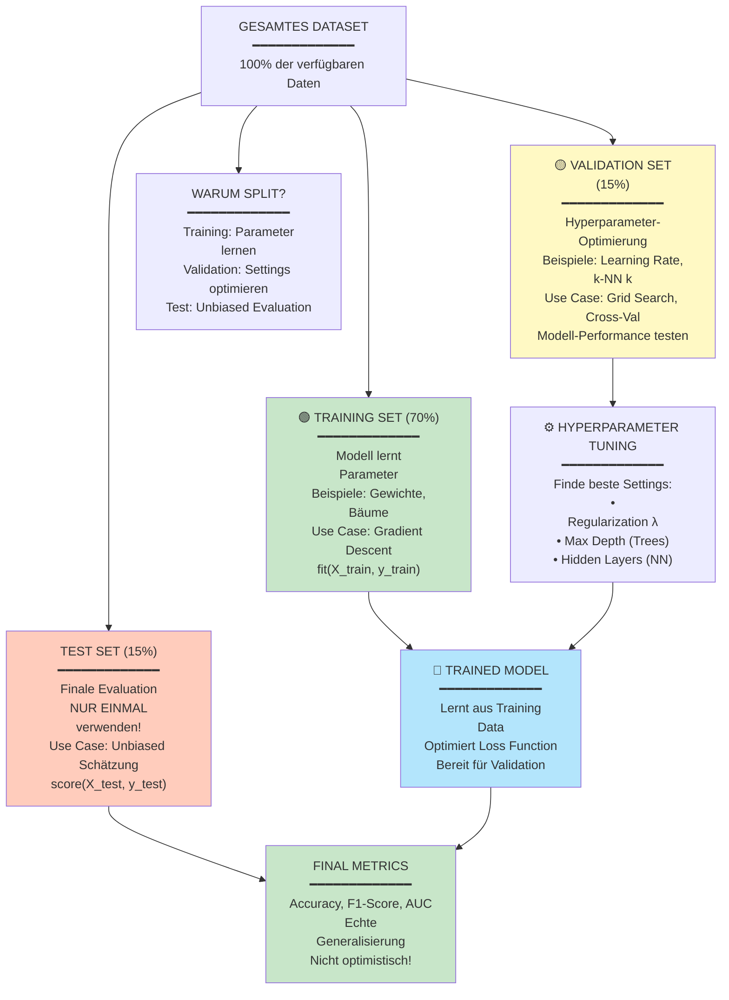

    style D fill:#c8e6c9
```

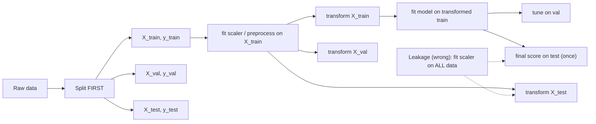

**Gesamtes Dataset**

| Dataset | Training (70%) | Validation (15%) | Test (15%) |
|---------|----------------|-----------------|------------|
| Zweck | Zum Trainieren des Modells | Zum Tunen der Hyperparameter | Zum Finalen Testen |

### 7.2 Zweck jeder Komponente

**Training Set (70%):**
- **Zweck:** Modellparameter lernen
- **Verwendung:** `model.fit(X_train, y_train)`
- **Nicht öffentlich:** Modell sieht diese Daten

**Validation Set (15%):**
- **Zweck:** Hyperparameter tunen
- **Verwendung:** Test verschiedene k-Werte, Architekturen, etc.
- **Zweck:** Early Stopping erkennen
- **Problem:** Indirekt "Overfitting" auf Val-Set
- **Lösung:** Mit neuem Test-Set evaluieren

**Test Set (15%):**
- **Zweck:** **Finale unabhängige Evaluation**
- **Verwendung:** Erst am Ende! `model.score(X_test, y_test)`
- **Kritisch:** Niemals vor Finalem Report anschauen!
- **Gültigkeit:** Erste (und einzige) ehrliche Schätzung der Performance

### 7.3 Stratifiziertes Splitting

**Problem:** Bei unbalancierten Klassen kann zufälliges Splitting zu Verzerrungen führen.

**Beispiel:**
- Gesamtdatensatz: 90% Apfel, 10% Banane
- Zufälliger Split könnte führen zu:
  - Train: 85% Apfel, 15% Banane (nicht repräsentativ!)
  - Test: 95% Apfel, 5% Banane

**Lösung:** Stratifiziertes Splitting
- Erhält die Klassenverteilung in jedem Split
- In scikit-learn: `stratify=y`

```python
X_train, X_test, y_train, y_test = train_test_split(
    X, y,
    test_size=0.3,
    stratify=y,  # ← Wichtig bei Imbalance!
    random_state=42
)
```

---

## 8. K-Fold Cross-Validation

### 8.1 Das Problem mit festem Split

Bei kleinen Datensätzen ist ein einzelner 70/30-Split **verschwendet**:
- 30% der Daten gehen nur für Test verloren
- Nur 70% zum Trainieren
- Statistik: Nur eine Schätzung der Performance (mit hoher Varianz)

### 8.2 K-Fold Cross-Validation Prinzip

**Idee:** Jeden Datenpunkt **sowohl für Training als auch Validierung** nutzen!

#### Beispiel: 3-Fold Cross-Validation

```
**3-Fold Cross-Validation Beispiel:**

| Fold | Iteration 1 | Iteration 2 | Iteration 3 |
|------|-------------|-------------|-------------|
| Data | V, T, T | T, V, T | T, T, V |
| Validation | V | T | T |
| Training | T, T | V, T | T, V |
| Metric | 0.92 | 0.88 | 0.90 |

**Finale Schätzung:**
- Durchschnitt = (0.92 + 0.88 + 0.90) / 3 = 0.90
- Std Dev = 0.017 (Variabilität)
```

### 8.3 Interpretation der Ergebnisse

**Report für K-Fold (k=10):**
```
KNeighborsClassifier: mean=0.96, std=0.023
SVC:                  mean=0.98, std=0.012
LogisticRegression:   mean=0.95, std=0.031
```

**Interpretation:**
- **Mean:** Durchschnittliche Performance über alle 10 Splits
- **Std:** Standard-Abweichung → Stabilität
  - Niedriges Std: Konsistent gutes Modell
  - Hohes Std: Modell ist volatil (manchmal gut, manchmal schlecht)

**Wichtig:** Cross-Validation **verbessert nicht** die Modellperformance!
- Sie gibt nur eine **bessere Schätzung** der echten Performance
- Der gleiche Datensatz wird mehrfach recycliert

### 8.4 Wann Cross-Validation verwenden?

- ✅ Kleine Datensätze (< 1000 Samples)
- ✅ Hyperparameter-Tuning
- ✅ Modellauswahl
- ❌ Große Datensätze (redundant und teuer)
- ❌ Online-Learning (kontinuierliches Training)

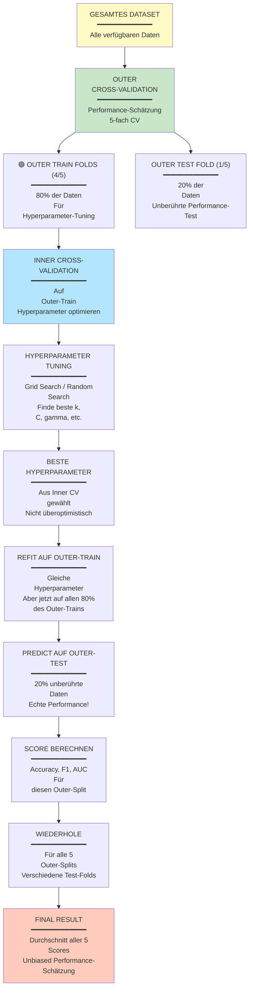

---

## 9. Datenexploration und Feature Engineering

### 9.1 Warum Daten visualisieren?

**Essenzielle Gründe:**

1. **Fehler entdecken**
   - Falsche Datentypen
   - Fehlende Werte
   - Ausreißer
   - Inkonsistenzen in Meseinheiten

2. **Klassenverteilung verstehen**
   - Sind Klassen balanciert?
   - Wie viele Samples pro Klasse?

3. **Lösbarkeit ohne ML checken**
   - "Kann ich das Problem ohne ML lösen?"
   - Manchmal sind einfache Regeln ausreichend

4. **Features verstehen**
   - Welche Features diskriminieren gut zwischen Klassen?
   - Welche Features sind redundant?

### 9.2 Feature Representations

**Definition:** Ein **Feature** ist eine messbare Größe, die beschreibt, was wir
vorhersagen möchten.

**Beispiel - Obstklassifizierung:**

| Objekt | Height | Width | Mass | Color Score | **Label** |
|--------|--------|-------|------|-------------|-----------|
| 1 | 7.0 | 8.0 | 155 | 0.67 | Apple |
| 2 | 4.5 | 3.2 | 40 | 0.75 | Mandarin |
| 3 | 9.2 | 8.5 | 190 | 0.52 | Orange |
| … | … | … | … | … | … |

**Features:** height, width, mass, color_score (Input Variables)
**Label:** Fruit Type (Target Variable)

**Mathematische Notation:**

```math

X = \begin{bmatrix}
7.0 & 8.0 & 155 & 0.67 \\
4.5 & 3.2 & 40 & 0.75 \\
9.2 & 8.5 & 190 & 0.52
\end{bmatrix}, \quad y = \begin{bmatrix} \mathrm{Apple} \\ \mathrm{Mandarin} \\
\mathrm{Orange} \end{bmatrix}

```

### 9.3 Feature-Typen

**Kontinuierliche Features:**
- Werte: Beliebige Zahlenwerte in einem Range
- Beispiele: height, weight, temperature

**Kategorische Features:**
- Werte: Festgelegte Kategorien
- Beispiele: Farbe (rot, grün, blau), Stadt (Zürich, Basel, Bern)
- Behandlung: **One-Hot-Encoding** für ML

**Ordinale Features:**
- Kategorisch aber mit **natürlicher Ordnung**
- Beispiele: Größe (XS, S, M, L, XL), Sterne (⭐ bis ⭐⭐⭐⭐⭐)

**Binäre Features:**
- Nur 2 Werte
- Beispiele: Ja/Nein, männlich/weiblich, vorhanden/nicht-vorhanden

### 9.4 Feature Visualization Techniken

#### 2D Scatterplot
```python
plt.scatter(X['height'], X['width'], c=y, cmap='viridis')
plt.xlabel('Height')
plt.ylabel('Width')
plt.show()
```
**Erkenntnis:** Zeigt Cluster und Trennung zwischen Klassen in 2D

#### 3D Scatterplot
```python
fig.add_subplot(111, projection='3d')
ax.scatter3D(X['height'], X['width'], X['color_score'], c=y)
```
**Erkenntnis:** Addiert dritte Dimension, Klassengrenzen sichtbar?

#### Pairwise Feature Scatterplot (Seaborn)
```python
sns.pairplot(data, hue='label')
```
**Erkenntnis:** Alle **Kombinationen von Feature-Paaren**
- Diagonal: Histogramme einzelner Features
- Off-diagonal: Scatterplots von Feature-Paaren
- Farbe nach Label

#### Histogramme
```python
plt.hist(X[X['label']=='Apple']['height'], label='Apple', alpha=0.5)
plt.hist(X[X['label']=='Orange']['height'], label='Orange', alpha=0.5)
```
**Erkenntnis:** Verteilung eines Features pro Klasse

---

## 10. K-Nearest Neighbors (KNN) Klassifizierung

### 10.1 Grundkonzept

**Intuition:** "Der Apfel, der meinem Apfel am ähnlichsten sieht, ist wahrscheinlich auch
ein Apfel."

**Algorithmus:**

Gegeben:
- Trainigsdatensatz $X_{train}$ mit Labels $y_{train}$
- Ein neuer Punkt $x_{test}$ zum Klassifizieren
- Parameter $k$ (Anzahl der Nachbarn)

Vorgehen:
1. Berechne **Abstände** von $x_{test}$ zu **allen** $X_{train}$-Punkten
2. Finde die **k nächsten** Punkte
3. Bestimme die **häufigste Klasse** unter diesen k Nachbarn
4. **Vorhersage** = diese häufigste Klasse

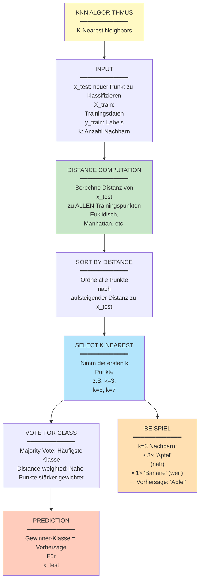

### 10.2 Distanzmetriken

**Euklidische Distanz** (Standard):

```math

d(x_i, x_j) = \sqrt{\sum_{m=1}^{p} (x_{i,m} - x_{j,m})^2}

```

**Beispiel:** Zwei Obststücke mit Features (height, width):
- Punkt A: (7.0, 8.0)
- Punkt B: (6.5, 8.2)

```math

d(A, B) = \sqrt{(7.0 - 6.5)^2 + (8.0 - 8.2)^2} = \sqrt{0.25 + 0.04} = \sqrt{0.29} \approx
0.54

```

**Beispiel:** Zwei Obststücke mit Features (height, width):
- Punkt A: (7.0, 8.0)
- Punkt B: (6.5, 8.2)

```math

d(A, B) = \sqrt{(7.0 - 6.5)^2 + (8.0 - 8.2)^2} = \sqrt{0.25 + 0.04} = \sqrt{0.29} \approx
0.54

```

**Andere Distanzen:**
- **Manhattan-Distanz:** $|x_{i,1} - x_{j,1}| + |x_{i,2} - x_{j,2}| + \ldots$
- **Chebyshev-Distanz:** $\max(|x_{i,1} - x_{j,1}|, |x_{i,2} - x_{j,2}|, \ldots)$

### 10.3 Parameter und Konfiguration

KNN benötigt 3+ Entscheidungen:

**1. Distanzmetrik** (typisch: Euklidisch)
```python
knn = KNeighborsClassifier(metric='euclidean')
```

**2. k-Wert** (wie viele Nachbarn?)
```python
knn = KNeighborsClassifier(n_neighbors=5)
```
- k=1: **Zu flexibel** (memoriert Trainigsdaten)
- k=5-10: **Gutes Mittelmaß** (unsere Wahl)
- k=100: **Zu starr** (glättet zu sehr)

**3. Aggregationsmethode** (wie kombiniere ich k Nachbarklassen?)
- **Majority Voting** (Standard): Häufigste Klasse
- **Weighted Voting:** Nähere Nachbarn zählen mehr

**4. Optional: Gewichtung**
```python
knn = KNeighborsClassifier(
    n_neighbors=5,
    weights='distance'  # Nähere Punkte zählen mehr
)
```

### 10.4 Visualisierung: Entscheidungsgrenzen

Mit k=1:
- Jede Region gehört zum nächsten Trainigspunkt
- **Sehr wackelige** Grenzen (Memorieren)

Mit k=5:
- Glattere Grenzen
- Besser generalisierbar

Mit k=45:
- **Sehr glatte** Grenzen
- Aber: Underfitting möglich

**Entscheidungsgrenzen: k-Wert Effekt**

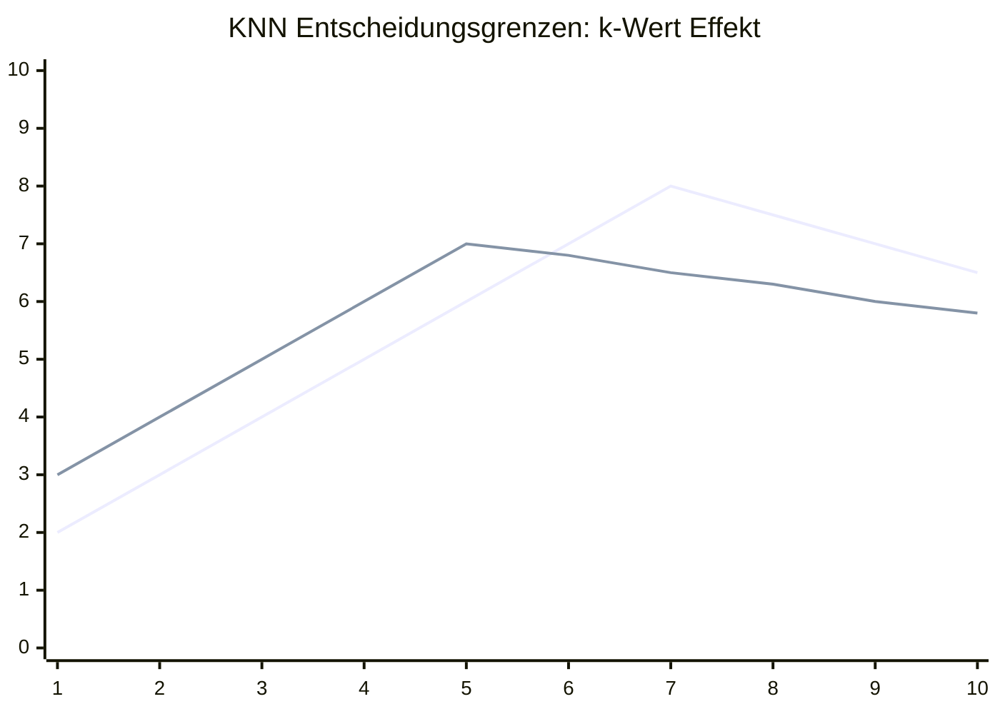

**Legende:**
- Blaue Linie: k=1 (komplexe, wackelige Grenzen)
- Orange Linie: k=15 (glattere, stabilere Grenzen)

**k=1:** Sehr flexible, komplexe Grenzen (hohe Variance)
**k=15:** Stabilere, einfachere Grenzen (höherer Bias)

### 10.5 Vor- und Nachteile KNN

| Vorteil | Nachteil |
|---------|----------|
| ✅ Sehr einfach zu verstehen | ❌ Abstandsberechnung teuer für große Datensätze |
| ✅ Keine Trainingsphase nötig | ❌ Schlecht bei hochdimensionalen Daten (Curse of
Dimensionality) |
| ✅ Funktioniert mit kleinen Datasets | ❌ Sensitive gegenüber Datenskalierung |
| ✅ Ergebnisse interpretierbar | ❌ Alle Features müssen numerisch sein |

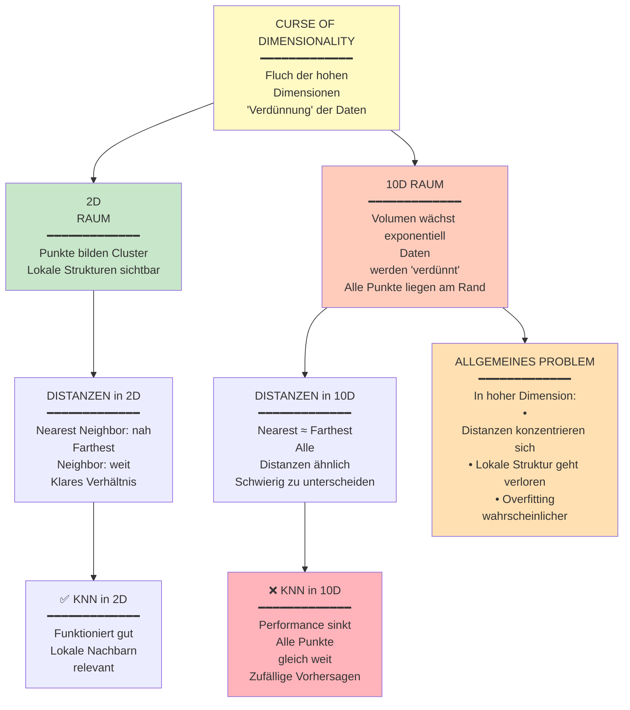

---

## 11. Daten-Skalierung

### 11.1 Das Skalierungsproblem

**Problem:** Features haben unterschiedliche **Skalen**!

**Beispiel:**
- Height: 3-10 cm
- Weight: 40-500 g

Euklidische Distanz:

```math

d = \sqrt{(h_1 - h_2)^2 + (w_1 - w_2)^2}

```

**Problem:** Weight-Unterschiede dominieren! $(400)^2 >> (7)^2$

**Visualization:**

```mermaid
xychart-beta
    title "Unscaled Data: Weight dominates distance calculation"
    x-axis "Height (cm)" 3 --> 7
    y-axis "Weight (g)" 0 --> 500
    line [4.2, 4.2, 7, 4.2]
    scatter [3.5, 4.8, 5.2, 6.1] [50, 200, 350, 450]
```

```mermaid
xychart-beta
    title "Scaled Data: Balanced feature importance"
    x-axis "Height (scaled)" 0 --> 1
    y-axis "Weight (scaled)" 0 --> 1
    line [0.4, 0.6, 0.6, 0.4]
    scatter [0.2, 0.6, 0.8, 0.95] [0.1, 0.4, 0.7, 0.9]
```

**Entscheidungsgrenzen:**
- **Links (unskaliert):** Nicht-sphärisch, verzerrt durch Weight-Dominanz
- **Rechts (skaliert):** Schön sphärisch, beide Features gleich wichtig

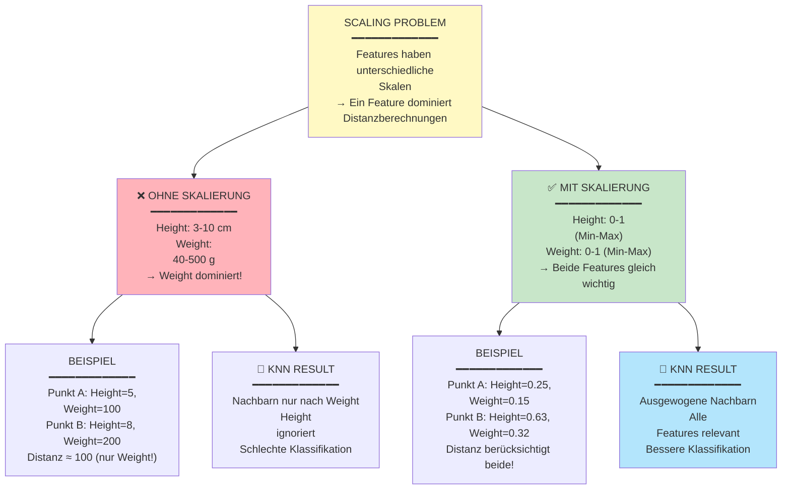

### 11.2 Skalierungsmethoden

#### MinMaxScaler (Normalisierung)

Transformiere jeden Feature auf $[0, 1]$:

```math

x'_i = \frac{x_i - \min(x)}{\max(x) - \min(x)}

```

**Beispiel:**
- Original: height = 7.5, min=3, max=10
- Skaliert: $\frac{7.5 - 3}{10 - 3} = \frac{4.5}{7} \approx 0.64$

```python
from sklearn.preprocessing import MinMaxScaler

scaler = MinMaxScaler()
X_scaled = scaler.fit_transform(X_train)  # Nur Training fitten!
X_test_scaled = scaler.transform(X_test)  # Mit Train-Parametern!
```

#### StandardScaler (Standardisierung)

Transformiere zu **Mittelwert = 0, Std-Dev = 1**:

```math

x'_i = \frac{x_i - \mu}{\sigma}

```

Wobei:
- $\mu$ = Mittelwert
- $\sigma$ = Standardabweichung

```python
from sklearn.preprocessing import StandardScaler

scaler = StandardScaler()
X_scaled = scaler.fit_transform(X_train)
```

### 11.3 Kritische Regeln

**MUSS beachtet werden:**

1. **Nur auf Trainigsdaten fitten!**
   ```python
   scaler.fit(X_train)  # ✅ Richtig
   scaler.fit(X_test)   # ❌ Falsch!
   ```

2. **Gleichen Scaler auf Test anwenden!**
   ```python
   X_train_scaled = scaler.fit_transform(X_train)
   X_test_scaled = scaler.transform(X_test)  # Mit Train-Parametern
   ```

3. **Warum?** Wenn wir Test-Statistiken nutzen, "leaken" wir Information aus Test in
Training!

---

## 12. Lineare Regression

### 12.1 Regression vs. Klassifizierung

| Aspekt | Klassifizierung | Regression |
|--------|-----------------|-----------|
| Output | Diskrete Klasse | Kontinuierliche Zahl |
| Beispiele | Spam/Nicht-Spam | Preis, Temperatur |
| Ausgabefunktion | Diskontinuierlich | Kontinuierlich |

### 12.2 Lineares Regressionsmodell

**Definition:** Finde Parameter $\beta_1, \beta_0$ so dass:

```math

\hat{y} = \beta_1 \cdot x + \beta_0

```

Wobei:
- $x$ = Input
- $\hat{y}$ = Vorhersage
- $\beta_1$ = Steigung (Coefficient)
- $\beta_0$ = Intercept (y-Achsen-Abschnitt)

**Ziel:** Minimiere Fehler zwischen $y$ (Realität) und $\hat{y}$ (Vorhersage)

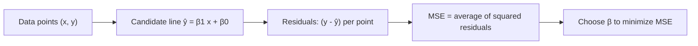

### Gradient Descent: Wie Parameter optimiert werden

```mermaid
graph TD
    A[Start mit zufälligen Parametern] --> B[Berechne Vorhersage ŷ]
    B --> C[Berechne Fehler/Verlust L]
    C --> D[Berechne Gradient ∂L/∂θ]
    D --> E[Update Parameter: θ = θ - α * ∇L]
    E --> F{Ist Minimum<br/>erreicht?}
    F -->|Nein| B
    F -->|Ja| G[Optimale Parameter gefunden]

    H[Beispiel: Lineare Regression] --> H1[L = Σ(y - ŷ)²]
    H --> H2[∇L = ∂L/∂m, ∂L/∂b]
    H --> H3[Update: m,b mit Lernrate α]

    I[Hyperparameter] --> I1[Lernrate α: Zu klein=slow, Zu groß=overshoot]
    I --> I2[Batch Size: Full vs Mini vs Stochastic]
    I --> I3[Epochs: Wie oft durch Daten gehen]

    style A fill:#ffebee
    style G fill:#c8e6c9
```

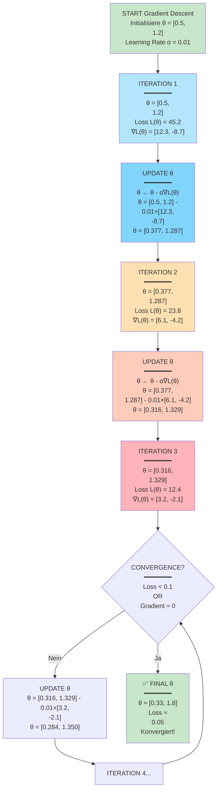

#### Visualisierung: Gradient Descent in Aktion

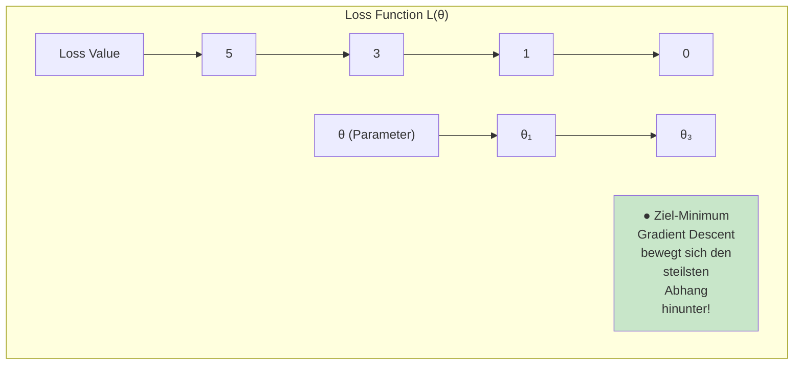

### 12.2.1 Learning Curve: Training-Progress visualisiert

**Was passiert während des Trainings?**
- **Loss:** Wie gut passt das Modell zu den Daten?
- **Training Loss:** Wie gut auf Trainingsdaten?
- **Validation Loss:** Wie gut auf ungesehenen Daten?

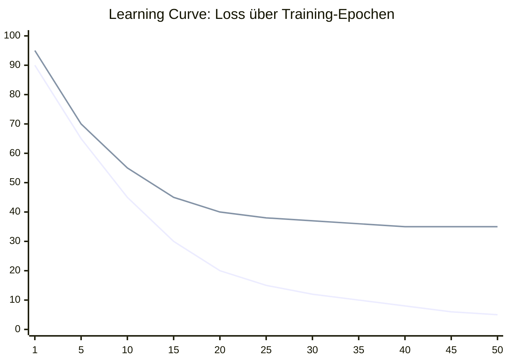

**Legende:**
- Blaue Linie: Training Loss (fällt kontinuierlich)
- Orange Linie: Validation Loss (fällt dann stagniert/steigt)

**Interpretation:**
- **Training Loss ↓:** Modell lernt die Trainingsdaten
- **Validation Loss ↓ dann →:** Anfangs Generalisierung, dann Overfitting
- **Optimal:** Stoppe bei Minimum der Validation Loss
- **Overfitting:** Wenn Validation Loss wieder steigt

### 12.3 Beispiel: Fahrenheit zu Celsius

**Problem:** Konvertiere Temperatur von °F zu °C

**Wahre Funktion** (müssen wir nicht kennen, ist das Ziel!):
```math

y = (x - 32) \cdot \frac{5}{9}

```

**Trainigsdaten (mit Messfehler):**

| °F | °C |
|----|-----|
| 50 | 10.0 |
| 86 | 30.2 |
| 104 | 40.1 |
| 113 | 45.0 |
| 122 | 50.2 |

**Lineares Modell finden:**

Löse das Gleichungssystem:
```math

\begin{align}
10.0 &= 50 \cdot \beta_1 + \beta_0 \\
30.2 &= 86 \cdot \beta_1 + \beta_0 \\
40.1 &= 104 \cdot \beta_1 + \beta_0 \\
45.0 &= 113 \cdot \beta_1 + \beta_0 \\
50.2 &= 122 \cdot \beta_1 + \beta_0
\end{align}

```

**Ergebnis:** [ \beta_1 \approx 0.556, \beta_0 \approx -17.78 ]

**Modell:** $\hat{y} = 0.556 \cdot x - 17.78$

### 12.4 Lineare Regression in scikit-learn

```python
from sklearn.linear_model import LinearRegression

lr = LinearRegression()
lr.fit(X_train.reshape(-1, 1), y_train)

# Vorhersagen
y_pred = lr.predict(X_test.reshape(-1, 1))

# Parameter
print(f"Slope: {lr.coef_[0]:.4f}")
print(f"Intercept: {lr.intercept_:.4f}")
```

### 12.5 Bewertungsmetriken für Regression

**Mean Squared Error (MSE):**
```math

MSE = \frac{1}{N} \sum_{i=1}^{N} (y_i - \hat{y}_i)^2

```
- Fehler werden quadriert → große Fehler stark bestraft
- Intuition: Durchschnittliches quadriertes Fehler

**Mean Absolute Error (MAE):**
```math

MAE = \frac{1}{N} \sum_{i=1}^{N} |y_i - \hat{y}_i|

```
- Intuitive Interpretation
- Weniger sensitive gegenüber Ausreißern

---

## 13. Logistische Regression und Entscheidungsgrenzen

### 13.1 Das Problem mit linearer Regression für Klassifizierung

**Naiv:** Nutze lineare Regression für Klassifizierung

**Modell:** $\hat{y} = \beta_1 \cdot x_1 + \beta_2 \cdot x_2 + \beta_0$

**Problem:** Output ist **unbegrenzt**!

Beispiel: Modell gibt $\hat{y} = -5$ oder $\hat{y} = 100$ aus
- Aber wir brauchen Wahrscheinlichkeit zwischen 0 und 1!

### 13.2 Sigmoid-Funktion

**Lösung:** Quetsche linearen Output durch **Sigmoid-Funktion**:

```math

\sigma(z) = \frac{1}{1 + e^{-z}}

```

**Eigenschaften:**
- Input: beliebig ($-\infty$ bis $+\infty$)
- Output: immer zwischen 0 und 1
- S-förmig (daher "Sigmoid")
- Differenzierbar (wichtig für Optimierung)

**Visualisierung:**

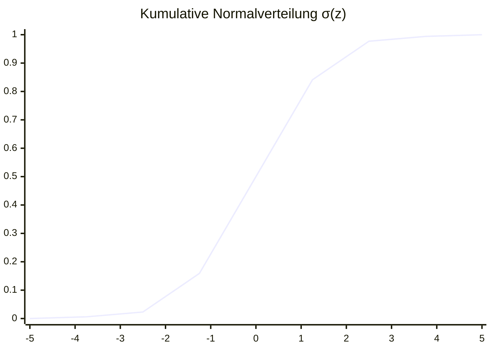

σ(-∞) = 0,  σ(0) = 0.5,  σ(+∞) = 1

### 13.3 Logistische Regression

**Modell:**

Erst: Lineare Funktion
```math
z = \beta_1 \cdot x_1 + \beta_2 \cdot x_2 + \beta_0
```

Dann: Durch Sigmoid
```math
\hat{p} = \sigma(z) = \frac{1}{1 + e^{-z}} \in [0, 1]
```

```mermaid
flowchart LR
  X["Features (x1, x2, ...)"] --> Z["Linear score z = β·x + β0"]
  Z --> S["Sigmoid: p = 1/(1+e^{-z})"]
  S --> T{p > 0.5?}
  T -->|Yes| C1["Predict class 1"]
  T -->|No| C0["Predict class 0"]
```

**Interpretation:** [ \hat{p} ] = Wahrscheinlichkeit für Klasse 1

**Entscheidungsregel:**
- Wenn [ \hat{p} > 0.5 ]: Vorhersage = Klasse 1
- Wenn [ \hat{p} \leq 0.5 ]: Vorhersage = Klasse 0

### 13.4 Entscheidungsgrenzen mit linearem Modell

**Entscheidungsgrenze:** Die Kurve, wo [ \hat{p} = 0.5 ]

Gegeben 2 Features [ x_1, x_2 ]:
[
0.5 = \sigma(\beta_1 \cdot x_1 + \beta_2 \cdot x_2 + \beta_0)
]

Inverse Sigmoid (Logit):
[
\beta_1 \cdot x_1 + \beta_2 \cdot x_2 + \beta_0 = 0
]

**Das ist eine Linie!** (oder Hyperplane in höheren Dimensionen)

**Beispiel:**
- Parameter gefunden: [ \beta_1 = 1, \beta_2 = 1.5, \beta_0 = 0 ]
- Entscheidungsgrenze: [ 1 \cdot \text{mass} + 1.5 \cdot \text{height} = 0 ]

```mermaid
flowchart TD
  Z0["Decision boundary: z = β·x + β0 = 0"] --> LIN["In 2D: a line"]
  LIN --> HP["In higher-D: a hyperplane"]
  HP --> LIM["Limitation: only linear separations without feature transforms"]
```

### 13.5 Limitation: Lineare Grenzen

**Problem:** Logistische Regression kann **nur lineare Grenzen** zeichnen!

Wenn Daten nicht **linear separabel** sind, funktioniert's nicht gut.

**Lösung:** Komplexere Modelle
- Decision Trees (beliebig geformte Grenzen)
- Support Vector Machines (mit Kernel)
- Neural Networks (beliebig komplexe Grenzen)

---

## 📚 Zusammenfassung der Kernkonzepte

| Konzept | Definition | Beispiel |
|---------|-----------|----------|
| **Feature** | Messbare Eingabegröße | height=7.5cm |
| **Label/Target** | Zu vorhersagende Größe | fruit_type=Apple |
| **Training** | Modell mit Daten fittenlernen | `model.fit(X, y)` |
| **Inference** | Vorhersage machen | `model.predict(X_new)` |
| **Generalisierung** | Gut auf **neuen** Daten arbeiten | Train ≠ Test |
| **KNN** | k-Nearest Neighbors Klassifizierer | k=5, Mehrheitsvoting |
| **Regression** | Vorhersage kontinuierlicher Wert | Temperaturvorhersage |
| **Klassifizierung** | Vorhersage diskrete Klasse | Apfel vs. Orange |
| **Cross-Validation** | k-Fold Datenzirkulation | k=10, bessere Schätzung |
| **Skalierung** | Daten normalisieren/standardisieren | MinMaxScaler, StandardScaler |

---

## 🎯 Lernziele

Nach diesem Skript sollten Sie verstehen:

1. ✅ **Motivationen:** Warum ML nutzen? Wann ist es sinnvoll?
2. ✅ **Grundkonzepte:** Supervised vs. Unsupervised, Classification vs. Regression
3. ✅ **Historischer Kontext:** AI Winter, Perceptron, Deep Learning Revolution
4. ✅ **Workflow:** Representation → Evaluation → Optimization
5. ✅ **Daten-Paradigma:** Kein Modell ohne Daten, Modality matching
6. ✅ **Train/Val/Test:** Warum 3 Splits? Generalisierung
7. ✅ **Cross-Validation:** k-Fold für kleine Datensätze
8. ✅ **Datenexploration:** Features verstehen, Visualisierung
9. ✅ **KNN-Algorithmus:** Intuition, Parameter, Entscheidungsgrenzen
10. ✅ **Skalierung:** Warum? MinMax vs. Standard Scaler
11. ✅ **Lineare Regression:** Parameter finden, MSE/MAE
12. ✅ **Logistische Regression:** Sigmoid-Funktion, lineare Grenzen
13. ✅ **Praktische Implementierung:** scikit-learn Code für alle Konzepte

---

## 📖 Weiterführende Ressourcen

- **scikit-learn Dokumentation:** https://scikit-learn.org/
- **Hands-On ML Book:** "Hands-On Machine Learning" (Aurélien Géron)
- **Feature Scaling:** https://scikit-learn.org/stable/modules/preprocessing.html
- **Cross-Validation:** https://scikit-learn.org/stable/modules/cross_validation.html
- **ML Map:** https://scikit-learn.org/stable/tutorial/machine_learning_map/

---

*Skript erstellt: Dezember 2025 - Basierend auf FCS-BWL Machine Learning 1 Kurs (Woche
10)*