# Machine Learning 2 - Ausführliches Skript
## Vollständiger Kurs: Klassifizierung, Evaluierung und Training

---

## 📋 Inhaltsverzeichnis

1. [Grundlagen der Klassifizierung](#1-grundlagen-der-klassifizierung)
2. [Klassifizierungstypen](#2-klassifizierungstypen)
3. [Fluch der Dimensionalität](#3-fluch-der-dimensionalität)
4. [Modellbewertung](#4-modellbewertung)
5. [Klassifizierer trainieren](#5-klassifizierer-trainieren)
6. [Overfitting und Underfitting](#6-overfitting-und-underfitting)
7. [Praktische Implementierung in
scikit-learn](#7-praktische-implementierung-in-scikit-learn)

---

## 1. Grundlagen der Klassifizierung

### 1.1 Was ist Klassifizierung?

Klassifizierung ist eine **überwachte Lernaufgabe**, bei der ein Modell lernt,
Eingabedaten in **vordefinierte Kategorien** einzuordnen. Im Gegensatz zur Regression,
die kontinuierliche Werte vorhersagt, produziert Klassifizierung **diskrete
Klassenbezeichnungen**.

**Beispiele für Klassifizierungsaufgaben:**
- Spam-Erkennung in E-Mails (Spam vs. Nicht-Spam)
- Bildklassifizierung (Hund, Katze, Vogel)
- Medizinische Diagnose (Krankheit vorhanden vs. nicht vorhanden)
- Bonitätsanalyse (Kreditwürdig vs. nicht kreditwürdig)

### 1.2 Lerntypen im Machine Learning

Das Machine Learning wird systematisch nach zwei Dimensionen eingeteilt:

| | Kontinuierliche Zielgröße | Kategorische Zielgröße |
|---|---|---|
| **Vorhersagen/Erklären** | **Regression** | **Klassifizierung** |
| **Unüberwacht Lernen** | Clustering (kontinuierliche Features) | Clustering
(kategorische Features) |

**Besonderheit: Reinforcement Learning** - Das Modell lernt, wie es in einer gegebenen
Umgebung handeln soll.

---

## 2. Klassifizierungstypen

Es gibt drei Haupttypen von Klassifizierungsproblemen, die sich in der Anzahl und Natur
der Zielklassen unterscheiden:

```mermaid
graph TD
    A[" Klassifizierung"] --> B[" Binäre Klassifizierung"]
    A --> C[" Multi-Klassen Klassifizierung"]
    A --> D[" Multi-Label Klassifizierung"]

    B --> B1["Genau 2 Klassen"]
    B --> B2["✅ Positiv/Negativ"]
    B --> B3[" Spam/Kein Spam"]

    C --> C1["3+ Klassen"]
    C --> C2[" Jede Instanz = 1 Klasse"]
    C --> C3[" Max Probability wählen"]

    D --> D1["️ Jede Instanz = Mehrere Klassen"]
    D --> D2[" Binary pro Klasse"]
    D --> D3["⚖️ One-vs-Rest"]

    B1 --> E["🧮 Mathematisch einfach"]
    C1 --> F[" Softmax für Wahrscheinlichkeiten"]
    D1 --> G[" Unabhängige Binary Classifier"]

    style A fill:#fff9c4
    style B fill:#c8e6c9
    style C fill:#b3e5fc
    style D fill:#ffe0b2
```

```mermaid
flowchart TD
  A[" Classification task"] --> B[" Binary"]
  A --> C[" Multi-class"]
  A --> D[" Multi-label"]

  B --> B1["y ∈ {0,1}"]
  B --> B2[" Model output: p(y=1|x) via sigmoid"]
  B --> B3["⚖️ Decision: p > threshold"]

  C --> C1["y ∈ {1,...,K}"]
  C --> C2[" Model output: K probabilities via softmax"]
  C --> C3[" Decision: argmax"]

  D --> D1["y ∈ {0,1}^K"]
  D --> D2[" Model output: K independent probs (K sigmoids)"]
  D --> D3[" Decision: per-label threshold(s)"]

  style A fill:#fff9c4
  style B fill:#c8e6c9
  style C fill:#b3e5fc
  style D fill:#ffe0b2
```





### 2.1 Binäre Klassifizierung

**Definition:** Genau zwei mögliche Klassen.

**Beispiele:**
- Positiv / Negativ
- Spam / Kein Spam
- Apfel / Banane

**Besonderheit:** Binäre Klassifizierung ist mathematisch am einfachsten zu implementieren
und wird oft als Grundlage für komplexere Szenarien verwendet.

```python
# Beispiel: Binäre Klassifizierung
y = [0, 1, 1, 0, 1, 0, ...]  # 0 = Apfel, 1 = Banane
```

### 2.2 Multi-Klassen Klassifizierung

**Definition:** Drei oder mehr mögliche Klassen, wobei jede Instanz genau einer Klasse
angehört.

**Beispiele:**
- Iris-Blüten-Klassifizierung (Setosa, Versicolor, Virginica)
- Ziffererkennung (0-9)
- Obst-Klassifizierung (Apfel, Orange, Zitrone, Mandarine)

**Besonderheit:** Jede Vorhersage muss genau eine Klasse sein. Der Klassifizierer
berechnet Wahrscheinlichkeiten für jede Klasse und wählt die mit der höchsten
Wahrscheinlichkeit.

```python
# Beispiel: Multi-Klassen Klassifizierung
y = [1, 2, 3, 4, 2, 1, ...]  # 1=Apfel, 2=Orange, 3=Zitrone, 4=Mandarine
```

### 2.3 Multi-Label Klassifizierung

**Definition:** Jede Instanz kann mehrere Klassen gleichzeitig haben.

**Beispiele:**
- Film-Tagging (ein Film kann Action, Drama UND Thriller sein)
- Medizinische Diagnose (ein Patient kann mehrere Krankheiten haben)
- Social Media Tagging (ein Post kann mit mehreren Tags versehen sein)

**Besonderheit:** Für jede Klasse wird eine separate binäre Vorhersage getroffen
(One-vs-Rest Ansatz).

```python
# Beispiel: Multi-Label Klassifizierung
y = [[1, 0, 1], [0, 1, 1], [1, 1, 0], ...]
#     Action Drama Thriller
```

---

## 3. Fluch der Dimensionalität

### 3.1 Definition und Konzept

```mermaid
graph TD
    A[" Fluch der Dimensionalität"] --> B[" Hochdimensionale Daten"]
    B --> C[" Datenpunkte werden spärlich"]
    B --> D[" Abstände werden gleich"]
    B --> E[" Statistische Methoden brechen zusammen"]

    C --> C1[" Nachbarn werden weit entfernt"]
    C --> C2["🤖 KNN funktioniert nicht mehr"]
    C --> C3[" Clustering wird unmöglich"]

    D --> D1[" Alle Punkte haben ähnliche Distanz"]
    D --> D2[" L2/L1 Norm konvergieren"]
    D --> D3[" Keine lokale Struktur mehr"]

    F[" Lösungen"] --> F1[" Feature Selection"]
    F --> F2[" Dimension Reduction"]
    F --> F3["🧠 Domain Knowledge"]
    F --> F4["⚖️ Regularisierung"]

    style A fill:#ffebee
    style F fill:#c8e6c9
```

```mermaid
flowchart TD
  D[" Increase dimensions d"] --> V[" Volume of space grows fast"]
  V --> S[" Same N points cover space more sparsely"]
  S --> C[" Local neighborhoods become empty"]
  C --> KNN[" Nearest neighbor distances increase"]
  KNN --> DC[" Nearest ≈ farthest (distance concentration)"]
  DC --> PERF[" Many distance-based methods degrade (e.g., KNN)"]

  style D fill:#fff9c4
  style V fill:#ffe0b2
  style PERF fill:#ffccbc
```





Der **Fluch der Dimensionalität** bezieht sich auf verschiedene Phänomene, die beim
Analysieren und Organisieren von Daten in hochdimensionalen Räumen auftreten.

**Wichtige Begriffe:**
- $d$ = Anzahl der Features (Dimensionen)
- $N$ = Anzahl der Beobachtungen (Datenpoints)

### 3.2 Warum ist das ein Problem?

**Schlüsselproblem:** Mit steigender Dimensionalität benötigen wir **exponentiell mehr
Daten**, um den Feature-Raum angemessen abzudecken.

**Mathematisches Verständnis:**
- Bei Nearest Neighbor-Algorithmen mit $d \leq 4$ und ausreichend großem $N$ funktioniert
das Verfahren gut
- Bei großem [ d ] werden die Nachbarn sehr weit entfernt (spärlicher Vektorraum)
- Der Algorithmus kann nicht mehr effektiv lernen

### 3.3 Beispiel: Fluch der Dimensionalität

**Szenario:** $N = 10$ Datenpunkte

**Eine Dimension:** Die Datenpunkte sind gut über die Linie verteilt.

**Zwei Dimensionen:** Manche Regionen sind untersampled, andere übersampled.

**Höhere Dimensionen:** Die meisten Regionen sind stark untersampled - die wenigen
Datenpunkte können die riesige Oberfläche nicht adequat repräsentieren.

**Konsequenz:** Je höher die Dimensionalität, desto schwächer die Leistung des Modells.

### 3.4 Lösungsansätze

1. **Mehr Daten sammeln** - Exponentiell mehr Daten mit mehr Dimensionen notwendig
2. **Dimensionalitätsreduktion** - Feature Selection oder Feature Engineering
3. **Regularisierung** - Das Modell zwingen, weniger komplexe Entscheidungsgrenzen zu
lernen
4. **Bessere Algorithmen wählen** - Tree-basierte Modelle sind weniger anfällig für hohe
Dimensionalität


---

## 4. Modellbewertung

### 4.1 Die Wichtigkeit der richtigen Metriken

**Kernfrage:** Ist 99.9% Genauigkeit gut oder schlecht?

Die Antwort: **Es kommt auf den Kontext an!**

**Warum nicht nur Accuracy verwenden:**
- **Klassenimbalance:** Bei stark unbalancierten Datensätzen kann ein
Dummy-Klassifizierer, der immer die Majorität vorhersagt, hohe Accuracy erreichen - aber
keine praktische Nutzung haben
- **Unterschiedliche Kosten:** Ein false positive und ein false negative können sehr
unterschiedliche Kosten haben

### 4.2 Verwirrungsmatrix (Confusion Matrix)

Die **Verwirrungsmatrix** ist das Fundament aller Klassifizierungsmetriken:

| Predicted/Actual | Positive | Negative |
|------------------|----------|----------|
| Positive        | TP      | FN      |
| Negative        | FP      | TN      |

**Definitionen:**
- **TP (True Positive):** Gehört zur Klasse und wurde als solche klassifiziert
- **TN (True Negative):** Gehört nicht zur Klasse und wurde nicht als solche klassifiziert
- **FP (False Positive):** Gehört nicht zur Klasse, wurde aber als solche klassifiziert
(Fehlalarm)
- **FN (False Negative):** Gehört zur Klasse, wurde aber nicht als solche klassifiziert
(Verpasster Fall)

```mermaid
flowchart TD
CM[" Confusion matrix counts (TP, FP, TN, FN)"] --> ACC[" Accuracy =
(TP+TN)/(TP+TN+FP+FN)"]
  CM --> PRE[" Precision = TP/(TP+FP)"]
  CM --> REC[" Recall = TP/(TP+FN)"]
  PRE --> F1[" F1 = 2 * (Precision×Recall)/(Precision+Recall)"]
  REC --> F1

  style CM fill:#fff9c4
  style ACC fill:#c8e6c9
  style PRE fill:#b3e5fc
  style REC fill:#ffe0b2
  style F1 fill:#ffccbc
```



### 4.3 Klassifizierungsmetriken

#### 4.3.1 Accuracy (Genauigkeit)

**Definition:** Der Anteil der korrekt klassifizierten Instanzen.

```math

\mathrm{Accuracy} = \frac{TP + TN}{TP + TN + FP + FN}

```

**Interpretation:** Wie viel Prozent aller Vorhersagen waren korrekt?

**Beispiel:** Hundeerkennung
- Accuracy = 0.95 bedeutet: Wir haben 95% aller Bilder korrekt klassifiziert

**Problem bei Klassenimbalance:**
- COVID-19 Test Beispiel: Wenn 99% der Bevölkerung nicht infiziert ist, kann ein
Dummy-Klassifizierer, der immer "Keine Infektion" vorhersagt, 99% Accuracy erreichen -
aber ist völlig nutzlos

#### 4.3.2 Precision (Präzision)

**Definition:** Von allen als positiv klassifizierten Instanzen, wie viele sind
tatsächlich positiv?

```math

\mathrm{Precision} = \frac{TP}{TP + FP}

```

**Interpretation:** Wie zuverlässig sind die positiven Vorhersagen?

**Formel-Erklärung:**
- Zähler: Korrekt als positiv identifiziert
- Nenner: Alle als positiv identifizierten (korrekt oder nicht)

**Beispiel:** Spam-Filter
- Precision = 0.95 bedeutet: Von 100 E-Mails, die wir als Spam klassifizieren, sind 95
tatsächlich Spam
- 5% sind Fehlalarme (wichtige Mails werden gelöscht)

**Wann verwenden:** Wenn die Kosten für Fehlalarme hoch sind.

### 4.3.3 ROC-Kurve: Threshold-Optimierung visualisiert

**ROC-Kurve = Receiver Operating Characteristic**
- **X-Achse:** False Positive Rate (FPR) = FP/(FP+TN)
- **Y-Achse:** True Positive Rate (TPR) = Recall = TP/(TP+FN)
- **Diagonale:** Random Classifier (AUC = 0.5)
- **Ziel:** Maximale AUC (Area Under Curve)


**Legende:**
- Blaue Linie: Perfekter Klassifizierer (AUC=1.0)
- Orange Linie: Guter Klassifizierer (AUC=0.8)
- Grüne Linie: Durchschnittlich (AUC=0.7)
- Rote Linie: Schlechter Klassifizierer (AUC=0.3)
- Violette Linie: Random Classifier (AUC=0.5)

**Interpretation:**
- **Punkt (0,1):** Perfekt - keine False Positives, alle True Positives
- **Nähe zur Diagonalen:** Schlechte Performance
- **AUC = 0.9+:** Exzellent
- **AUC = 0.8-0.9:** Gut
- **AUC = 0.7-0.8:** Akzeptabel
- **AUC < 0.7:** Verbesserungsbedarf

#### 4.3.4 Recall (Erfassung)

**Definition:** Von allen tatsächlich positiven Instanzen, wie viele haben wir erkannt?

```math

\mathrm{Recall} = \frac{TP}{TP + FN}

```

**Interpretation:** Wie vollständig erkennen wir positive Instanzen?

**Formel-Erklärung:**
- Zähler: Korrekt erkannt
- Nenner: Alle tatsächlich positiven (erkannt oder nicht)

**Beispiel:** Asteroid-Erkennung
- Recall = 0.95 bedeutet: Wir erkennen 95% aller Asteroiden
- Aber 5% der Asteroiden werden verpasst - das ist sehr problematisch!
- Recall ist kritisch: Besser einen Fehlalarm als einen Treffer verpassen

**Wann verwenden:** Wenn die Kosten für verpasste positive Fälle sehr hoch sind.

#### 4.3.4 F1-Score

**Definition:** Harmonisches Mittel von Precision und Recall.

```math

F1\text{-}Score = 2 \cdot \frac{\mathrm{Precision} \cdot
\mathrm{Recall}}{\mathrm{Precision} + \mathrm{Recall}}

```

**Warum harmonisch und nicht arithmetisch?**
- Das arithmetische Mittel würde zu extreme Ungleichgewichte ignorieren
- Das harmonische Mittel zieht beide Werte näher zusammen und ist sensitiv gegenüber
extremen Unterschieden

**Interpretation:** Ein ausgewogenes Maß zwischen Precision und Recall.

**Wann verwenden:** Wenn man einen Kompromiss zwischen Precision und Recall will.

**Beispiel: Self-Driving Cars**
- Objekt-Erkennung: Wollen maximalen Recall (Menschen auf der Straße müssen erkannt
werden)
- Wenn Recall = 1: Person wurde nicht überfallen
- Aber False Positives könnten hoch sein: Auto bremst zu oft automatisch
- Dennoch akzeptabel (Komfort < Sicherheit)

### 4.3.5 Precision-Recall Curve: Klassenimbalance meistern

**Warum Precision-Recall statt ROC bei Imbalance?**
- **ROC-Kurve:** Bevorzugt Majoritätsklasse bei Imbalance
- **PR-Kurve:** Zeigt wahre Performance auf Minoritätsklasse
- **Baseline:** Precision = Klassenanteil der Minoritätsklasse


**Legende:**
- Blaue Linie: Perfekter Klassifizierer (PR-AUC=1.0)
- Orange Linie: Guter Klassifizierer (PR-AUC=0.7)
- Grüne Linie: Random Classifier (PR-AUC≈0.1)
- Rote Linie: Baseline (PR-AUC=0.1)

**Interpretation bei 10% Minoritätsklasse:**
- **PR-AUC = 0.8:** Hervorragend - viel besser als Zufall
- **PR-AUC = 0.4:** Durchschnittlich - moderate Verbesserung
- **PR-AUC = 0.1:** Schlecht - nicht besser als Baseline
- **Ziel:** Maximale Fläche unter der Kurve

### 4.4 Praktisches Beispiel: Hundeerkennung

**Szenario:** "Gibt es einen Hund im Bild?"

**Verwirrungsmatrix (beispielhaft):**

| Predicted/Actual | Hund erkannt | Hund nicht erkannt |
|------------------|-------------|-------------------|
| Hund im Bild    | 95         | 5                |
| Kein Hund       | 5          | 895              |

**Metriken:**
- Accuracy = (95 + 895) / 1000 = 0.99 = 99%
  - "99% aller Bilder wurden korrekt klassifiziert"

- Precision = 95 / (95 + 5) = 0.95 = 95%
  - "Von den 100 als 'Hund' klassifizierten Bildern, sind 95 tatsächlich Hunde"

- Recall = 95 / (95 + 5) = 0.95 = 95%
  - "Von den 100 Bildern mit Hunden, haben wir 95 erkannt"

### 4.5 Klassenimbalance - Kritisches Problem

**Problem:** Wenn eine Klasse viel häufiger ist als die andere.

**Beispiel: COVID-19 Test (Extreme Imbalance)**

**Verwirrungsmatrix (10.000 Menschen getestet, 10 infiziert):**

| Predicted/Actual | Test positiv | Test negativ |
|------------------|-------------|-------------|
| Person infiziert | 0          | 10         |
| Person nicht infiziert | 0       | 9990      |

**Analyse:**
- Accuracy = (0 + 9990) / 10000 = 99.9%
- Aber der Klassifizierer hat **nichts gelernt**!
- Test positiv: 0 Treffer - der Klassifizierer sagt immer "negativ"


**Warum ist das ein Problem:**
- Accuracy ist nicht aussagekräftig bei Imbalance
- Precision und Recall sind weniger anfällig: Sie fokussieren auf die Minderheitsklasse

**Lösung:**
- Immer Precision und Recall betrachten
- F1-Score verwenden
- Stratified Splitting nutzen (beim Train-Test Split)

### 4.5.1 Confusion Matrix als Heatmap

**Visuelle Darstellung der Confusion Matrix:**

```mermaid
xychart-beta
    title "Confusion Matrix Heatmap"
    x-axis "Predicted" ["Negative", "Positive"]
    y-axis "Count" 0 --> 100
    bar [5, 95] "TP: 5"
    bar [15, 885] "FP: 15"
    bar [5, 95] "FN: 5"
    bar [885, 5] "TN: 885"
```

**Legende:**
- Blaue Balken: True Positive (TP): 5
- Orange Balken: False Positive (FP): 15
- Grüne Balken: False Negative (FN): 5
- Rote Balken: True Negative (TN): 885

**Perfekte Confusion Matrix (Ziel):**

```mermaid
xychart-beta
    title "Perfekte Confusion Matrix (AUC=1.0)"
    x-axis "Predicted" ["Negative", "Positive"]
    y-axis "Count" 0 --> 100
    bar [100, 0] "TP: 100"
    bar [0, 0] "FP: 0"
    bar [0, 100] "FN: 0"
    bar [0, 0] "TN: 0"
```

### 4.6 Classification Report in scikit-learn

```python
from sklearn.metrics import classification_report

print(classification_report(
    y_true=y_test, 
    y_pred=y_pred, 
    target_names=unique_names
))
```

**Beispiel Output:**
```
             precision  recall  f1-score  support
apple        0.67      0.50    0.57      4
mandarin     1.00      1.00    1.00      2
orange       0.38      0.75    0.50      4
lemon        0.50      0.20    0.29      5

accuracy                        0.53      15
macro avg    0.64      0.61    0.59      15
weighted avg 0.58      0.53    0.51      15
```

**Interpretation der Spalten:**
- **precision:** Pro Klasse - wie viele korrekt als diese Klasse klassifiziert?
- **recall:** Pro Klasse - wie viele dieser Klasse wurden erkannt?
- **f1-score:** Pro Klasse - harmonisches Mittel
- **support:** Wie viele Testproben pro Klasse?

**Averaging Options:**
- **macro avg:** Arithmetisches Mittel der Werte (alle Klassen gleich gewichtet)
- **weighted avg:** Gewichtetes Mittel (gewichtet nach Klassenhäufigkeit)
- **micro avg:** Globale TP, FP, FN (nur für spezielle Szenarien)

### 4.7 Metriken-Implementierung in Code

```python
from sklearn.metrics import (
    accuracy_score,
    precision_score,
    recall_score,
    f1_score,
    ConfusionMatrixDisplay
)

# Einzelne Metriken
accuracy = accuracy_score(y_true=y_test, y_pred=y_pred)
precision = precision_score(y_true=y_test, y_pred=y_pred, average='weighted')
recall = recall_score(y_true=y_test, y_pred=y_pred, average='weighted')
f1 = f1_score(y_true=y_test, y_pred=y_pred, average='weighted')

# Confusion Matrix visualisieren
ConfusionMatrixDisplay.from_predictions(
    y_true=y_test,
    y_pred=y_pred,
    display_labels=unique_names,
    normalize='pred'  # Normalisieren für bessere Lesbarkeit
)
```

---

## 5. Klassifizierer trainieren

### 5.1 Aufbau eines Klassifizierers

Ein Klassifizierer besteht aus:
1. **Modellarchitektur** - Die mathematische Struktur
2. **Trainable Parameter** - Die "Knöpfe" die wir einstellen
3. **Optimierungsalgorithmus** - Wie wir die Parameter anpassen

### 5.2 Das Perceptron Modell - Historischer Ursprung

**Perceptron** war eines der ersten neuronalen Netzwerke. Es hatte physische Knöpfe:
- Potentiometer für Gewichte
- Manuelle Anpassung durch experimentieren

**Moderne Frage:** Wie können wir diesen Prozess automatisieren?

### 5.3 Die Kernidee

Gegeben:
- Vorhersagen des Modells: $\hat{y}$
- Wahre Labels: $y$
- Parametrisiertes Modell: $f(x) = mx + b = \hat{y}$

**Ziel:** Finde die besten Parameter (hier: $m$ und $b$) automatisch.

### 5.4 Verlustfunktionen (Loss Functions)

Eine **Verlustfunktion** quantifiziert, wie weit unsere Vorhersagen vom Ziel entfernt
sind.

#### 5.4.1 Mean Absolute Error (MAE)

```math

MAE = \frac{1}{N} \sum_{i=1}^{N} |y_i - \hat{y}_i|

```

**Eigenschaften:**
- Intuitive Interpretation (durchschnittlicher Fehler in den gleichen Einheiten wie die
Daten)
- Robust gegen Ausreißer
- Nicht differenzierbar an null (kann problematisch sein)

#### 5.4.2 Mean Squared Error (MSE)

```math

MSE = \frac{1}{N} \sum_{i=1}^{N} (y_i - \hat{y}_i)^2

```

**Eigenschaften:**
- Quadrieren von Fehlern bestraft große Fehler stärker
- Überall differenzierbar (wichtig für Gradient Descent)
- Sensitiv gegen Ausreißer
- Standard in vielen Algorithmen

### 5.5 Gradient Descent (Rückwärtspropagierung)

**Kernidee:** Nutze die Ableitung (Gradient) der Verlustfunktion, um in die Richtung der
Verbesserung zu gehen.

```mermaid
flowchart TD
  INIT[" Initialize parameters (m, b)"] --> FWD[" Forward: ŷ = m × x + b"]
  FWD --> LOSS[" Compute loss (e.g., MSE)"]
  LOSS --> GRAD[" Compute gradients ∂Loss/∂m, ∂Loss/∂b"]
  GRAD --> UPD[" Update: θ ← θ - α∇Loss"]
  UPD --> FWD

  style INIT fill:#fff9c4
  style FWD fill:#c8e6c9
  style GRAD fill:#ffe0b2
  style UPD fill:#b3e5fc
```



**Mathematik:**

Für MSE mit linearer Funktion:

```math

MSE(m, b) = \frac{1}{N} \sum_{i=1}^{N} (y_i - (mx_i + b))^2

```

Die **partiellen Ableitungen** zeigen, wie sehr $m$ und $b$ den Verlust beeinflussen:

```math

\frac{\partial MSE}{\partial m} = \mathrm{Gradient\ bezgl.\ } m

```

```math

\frac{\partial MSE}{\partial b} = \mathrm{Gradient\ bezgl.\ } b

```

**Intuition:** 
- Positiver Gradient: Erhöhte Parameter verschlechtern den Fehler → Wir sollten sie senken
- Negativer Gradient: Erhöhte Parameter verbessern den Fehler → Wir sollten sie erhöhen

**Update Rule:**

```math

m \leftarrow m - \alpha \cdot \frac{\partial MSE}{\partial m}

```

```math

b \leftarrow b - \alpha \cdot \frac{\partial MSE}{\partial b}

```

Wobei $\alpha$ die **Learning Rate** ist (kleine positive Konstante).

**Algorithmus:**
1. Initialisiere $m$ und $b$ zufällig
2. Berechne Gradienten für aktuelle Parameter
3. Update Parameter in Richtung negative Gradienten
4. Wiederhole bis Konvergenz

**Learning Rate Interpretation:**
- Zu klein: Sehr lange zum Konvergieren
- Zu groß: Divergiert oder oszilliert
- Richtig: Schnelle und stabile Konvergenz

```mermaid
flowchart TD
  A[" Choose learning rate α"] --> Q[" Training stable?"]
  Q -->|"❌ No: diverges/oscillates"| BIG[" α too large → decrease α"]
  Q -->|"✅ Yes"| S[" Converges fast enough?"]
  S -->|" No: very slow"| SMALL[" α too small → increase α"]
  S -->|"⚡ Yes"| OK[" α appropriate"]

  style A fill:#fff9c4
  style OK fill:#c8e6c9
  style BIG fill:#ffccbc
  style SMALL fill:#ffe0b2
```



### 5.6 Beispiel: Linear Regression mit Gradient Descent

```python
# Hypothetischer Code für Gradient Descent

def gradient_descent(X_train, y_train, epochs=100, learning_rate=0.01):
    # Zufällige Initialisierung
    m = np.random.uniform(-5, 5)
    b = np.random.uniform(-5, 5)
    
    losses = []
    
    for epoch in range(epochs):
        # Forward pass
        y_pred = m * X_train + b
        
        # Compute loss
        loss = np.mean((y_train - y_pred) ** 2)
        losses.append(loss)
        
        # Compute gradients
        dm = -2 * np.mean(X_train * (y_train - y_pred))
        db = -2 * np.mean(y_train - y_pred)
        
        # Update parameters
        m = m - learning_rate * dm
        b = b - learning_rate * db
    
    return m, b, losses
```

---

## 6. Overfitting und Underfitting

### 6.1 Drei Szenarien beim Modell-Fitting

#### 6.1.1 Underfitting

**Definition:** Das Modell ist zu einfach und kann die zugrunde liegende Struktur nicht
erfassen.

**Beispiel:** Versuch, eine quadratische Funktion mit einer Geraden zu approximieren.

```
ŷ = β₁x + β₀
```

**Merkmale:**
- Hoher Trainingsfehler
- Hoher Validierungsfehler
- Schlechte Generalisierung, aber aus dem falschen Grund

**Ursachen:**
- Zu wenige Features
- Modell ist zu einfach für die Daten
- Zu früh gestoppt (bei Neural Networks)

**Lösungen:**
- Komplexeres Modell verwenden
- Mehr/bessere Features hinzufügen
- Training länger durchführen


### 6.1.1 Modell-Komplexität: Bias-Variance Trade-off

```mermaid
xychart-beta
    title "Bias-Variance Trade-off: Modell-Komplexität"
    x-axis ["Sehr einfach", "Optimal", "Sehr komplex"]
    y-axis 0 --> 100
    line [80, 20, 15]
    line [15, 20, 80]
    line [70, 15, 95]
```



**Legende:**
- Blaue Linie: Bias (Unteranpassung) - nimmt ab mit Komplexität
- Orange Linie: Variance (Überanpassung) - nimmt zu mit Komplexität
- Grüne Linie: Total Error - Bias + Variance, Minimum bei optimaler Komplexität

**Interpretation:**
- **Links:** Hoher Bias (Unteranpassung) - Modell zu einfach
- **Mitte:** Optimaler Balancepunkt
- **Rechts:** Hohe Variance (Überanpassung) - Modell zu komplex

#### 6.1.2 Good Fit

**Definition:** Das Modell findet einen guten Kompromiss zwischen Einfachheit und
Datenerklärung.

**Beispiel:** Angemessene polynomielle Regression

```
ŷ = β₄x⁴ + β₃x³ + β₂x² + β₁x + β₀
```

**Merkmale:**
- Niedriger Trainingsfehler
- Niedriger Validierungsfehler
- Gute Generalisierung

#### 6.1.3 Overfitting

**Definition:** Das Modell memoriert die Trainigsdaten statt die zugrunde liegende
Struktur zu lernen.

**Beispiel:** Ein 15-ter Ordnungs Polynomium für wenige Datenpunkte

```
ŷ = β₁₅x¹⁵ + β₁₄x¹⁴ + ... + β₀
```

**Merkmale:**
- Sehr niedriger Trainingsfehler (oft perfekt: 100%)
- Hoher Validierungsfehler (deutlich schlechter)
- Schlechte Generalisierung

**Warum ist das ein Problem?**
- Das Modell lernt Noise statt Patterns
- Auf neuen Daten wird es schlecht performen
- Besonders problematisch bei kleinen Datasets

### 6.2 Overfitting Mathematisch

**Kernproblem:** Der Modellkomplexität fehlt eine Begrenzung.

Gegeben ein Trainingsdatensatz mit $N$ Datenpunkten,
können wir mit einem Polynom vom Grad $N-1$ alle Punkte perfekt treffen - egal, wie
sinnlos das Modell ist.

```mermaid
flowchart TD
  T[" Observe train vs validation error"] --> U[" Train high?"]
  U -->|"✅ Yes"| UF[" Underfitting (too simple / not trained enough)"]
  U -->|"❌ No"| O[" Val high?"]
  O -->|"✅ Yes"| OF[" Overfitting (too complex / leakage / too long training)"]
  O -->|"❌ No"| GF[" Good fit (generalizes well)"]

  style T fill:#fff9c4
  style UF fill:#ffe0b2
  style OF fill:#ffccbc
  style GF fill:#c8e6c9
```



### 6.3 Training-, Validierungs- und Test-Sets

**Richtige Aufteitung ist kritisch:**


**Warum nicht einfach Train-Test Split?**
- Im Training-Prozess verbessern wir das Modell basierend auf Validation-Performance
- Indirekt "Cheat" wir auf dem Validation Set
- Test Set bleibt unberührt für finale ehrliche Evaluation

**Analoge:** 
- Training Data = Schulstoff
- Validation Data = Übungs-Altklausuren
- Test Data = Echte Prüfung

### 6.4 Strategien gegen Overfitting

#### 6.4.1 Early Stopping

**Idee:** Stoppe das Training, wenn der Validierungsfehler zu steigen beginnt.


#### 6.4.2 Regularisierung

**Idee:** Bestrafe komplexe Modelle.

**L1-Regularisierung (Lasso):**
```math

Loss = MSE + \lambda \sum_{i} |w_i|

```

**L2-Regularisierung (Ridge):**
```math

Loss = MSE + \lambda \sum_{i} w_i^2

```

Wobei $\lambda$ kontrolliert, wie stark die Bestrafung ist.

#### 6.4.3 Feature Selection

- Weniger Features = weniger Möglichkeiten zu overfittan
- Nur relevante Features behalten

#### 6.4.4 Data Augmentation

- Mehr Trainingsdaten sammeln
- Mit mehr Daten ist Overfitting weniger wahrscheinlich

#### 6.4.5 Model Simplification

- Einfachere Modellarchitektur verwenden
- Weniger Parameter

---

## 7. Praktische Implementierung in scikit-learn

### 7.1 Allgemeiner Workflow

```python
# 1. Daten laden und vorbereiten
from sklearn.model_selection import train_test_split

X_train, X_test, y_train, y_test = train_test_split(
    X, y, 
    train_size=0.8,
    test_size=0.2,
    stratify=y,  # Wichtig bei Imbalance!
    random_state=42
)

# 2. Daten skalieren
from sklearn.preprocessing import StandardScaler

scaler = StandardScaler()
X_train_scaled = scaler.fit_transform(X_train)
X_test_scaled = scaler.transform(X_test)

# 3. Modell erstellen
from sklearn.neighbors import KNeighborsClassifier

clf = KNeighborsClassifier(n_neighbors=5)

# 4. Trainieren
clf.fit(X_train_scaled, y_train)

# 5. Vorhersagen
y_pred = clf.predict(X_test_scaled)

# 6. Evaluieren
from sklearn.metrics import classification_report, accuracy_score

print(f"Accuracy: {accuracy_score(y_test, y_pred):.3%}")
print(classification_report(y_test, y_pred))
```

### 7.2 Verfügbare Klassifizierer in scikit-learn

**Wichtigste Klassifizierer:**
- **KNeighborsClassifier** - Nearest Neighbors
- **LogisticRegression** - Linear Boundary
- **SVC/LinearSVC** - Support Vector Machines
- **GaussianNB** - Naive Bayes
- **DecisionTreeClassifier** - Decision Trees
- **RandomForestClassifier** - Ensemble Method
- **MLPClassifier** - Neural Networks
- **GradientBoostingClassifier** - Boosting Ensembles

### 7.3 Confusion Matrix in scikit-learn

```python
from sklearn.metrics import ConfusionMatrixDisplay
import matplotlib.pyplot as plt

# Visualisieren
ConfusionMatrixDisplay.from_predictions(
    y_true=y_test,
    y_pred=y_pred,
    display_labels=class_names,
)
plt.show()

# Wichtiger Hinweis: scikit-learn dreht die Achsen um!
# Immer die Achsentitel beachten!
```

### 7.4 Hyperparameter Tuning

```python
# Verschiedene k-Werte für k-NN testen
from sklearn.model_selection import cross_val_score

k_values = range(1, 21)
scores = []

for k in k_values:
    clf = KNeighborsClassifier(n_neighbors=k)
    score = cross_val_score(
        clf, X_train, y_train,
        cv=5  # 5-fold Cross-Validation
    ).mean()
    scores.append(score)

# Besten k auswählen
best_k = k_values[np.argmax(scores)]
print(f"Bester k-Wert: {best_k}")
```

### 7.5 Cross-Validation

**Idee:** Verwende mehrere Train-Test Splits und mittele die Ergebnisse.

```python
from sklearn.model_selection import KFold, cross_val_score

kfold = KFold(n_splits=10, shuffle=True, random_state=42)

scores = cross_val_score(
    clf,
    X=X,
    y=y,
    cv=kfold
)

print(f"Mean Accuracy: {scores.mean():.3%}")
print(f"Std Dev: {scores.std():.3%}")
```

**Vorteil:** Bessere Nutzung begrentzer Daten, robustere Evaluation.

### 7.6 Daten-Skalierung

**Wichtig:** Viele Algorithmen sind sensitiv gegenüber verschiedenen Skalierungen.

```python
from sklearn.preprocessing import StandardScaler, MinMaxScaler

# Standardization (Mittel=0, Std=1)
scaler = StandardScaler()
X_scaled = scaler.fit_transform(X_train)  # Nur auf Train!
X_test_scaled = scaler.transform(X_test)  # Gleicher Scaler

# Normalization (Min-Max auf [0,1])
scaler = MinMaxScaler()
# Gleicher Workflow
```

**Wichtig:** Scaler nur auf Trainingsdaten fitten, dann auch auf Test anwenden!

---

## 📚 Zusammenfassung der Kernkonzepte

| Konzept | Definition | Beispiel |
|---------|-----------|----------|
| **Klassifizierung** | Vorhersage von diskreten Klassen | Email Spam-Filter |
| **Binary Classification** | 2 Klassen | Spam/Kein Spam |
| **Multi-Class** | 3+ Klassen | Ziffererkennung (0-9) |
| **Multi-Label** | Mehrere Klassen pro Instanz | Film-Genres |
| **Curse of Dimensionality** | Mehr Features = Weniger Daten pro Region | 100 Features,
nur 1000 Samples |
| **Precision** | Von erkannten, wie viele sind richtig? | 95% = 5% Fehlalarme |
| **Recall** | Von existierenden, wie viele erkannt? | 95% = 5% verpasst |
| **F1-Score** | Harmonisches Mittel von P und R | Balanciertes Maß |
| **Overfitting** | Memoriert Trainigs-Daten | Perfekt auf Train, schlecht auf Test |
| **Gradient Descent** | Optimierungsalgorithmus | Findet beste Parameter |
| **Train-Val-Test** | Richtige Aufteilung | 80-10-10 Split |


---

## 8. Praxis-Case Study 1: Fruits Dataset (KNN)

In diesem Beispiel klassifizieren wir Früchte (Apfel, Mandarine, Orange,
Zitrone) basierend auf ihren Eigenschaften (Höhe, Breite, Masse, Farb-Wert).

### 8.1 Daten laden und erkunden

```python
import pandas as pd
import numpy as np
import matplotlib.pyplot as plt
from sklearn.model_selection import train_test_split

# Daten laden
fruits = pd.read_csv('https://drive.switch.ch/index.php/s/wWTGBFrSSCTCphU/download')

# Mapping von Label (Zahl) zu Name
prediction_map = dict(zip(fruits.fruit_label.unique(), fruits.fruit_name.unique()))
print(prediction_map)
# {1: 'apple', 2: 'mandarin', 3: 'orange', 4: 'lemon'}

# Features und Labels trennen
X = fruits[['height', 'width', 'mass', 'color_score']]
y = fruits['fruit_label']

# Train-Test Split (75% Training, 25% Test)
X_train, X_test, y_train, y_test = train_test_split(X, y, random_state=42)
```

### 8.2 Visualisierung (3D Scatter Plot)

Um ein Gefühl für die Daten zu bekommen, plotten wir Breite, Höhe und Farb-Wert in 3D.

```python
from mpl_toolkits.mplot3d import Axes3D

fig = plt.figure(figsize=(10, 8))
ax = fig.add_subplot(111, projection='3d')

ax.scatter(X_train['width'], X_train['height'], X_train['color_score'], c=y_train,
marker='o', s=100)
ax.set_xlabel('Width')
ax.set_ylabel('Height')
ax.set_zlabel('Color Score')

plt.show()
```

### 8.3 K-Nearest Neighbors Classifier

Wir trainieren einen KNN mit `k=5`.

```python
from sklearn.neighbors import KNeighborsClassifier

knn = KNeighborsClassifier(n_neighbors=5)
knn.fit(X_train, y_train)

# Wie gut ist das Modell?
score = knn.score(X_test, y_test)
print(f"Accuracy: {score:.2%}") # z.B. 53.33% (KNN ist hier nicht perfekt!)
```

### 8.4 Neue Vorhersagen treffen

```python
# Eine kleine Frucht (Höhe 4.3, Breite 5.5, Masse 20g)
unknown_fruit = [[4.3, 5.5, 20, 0.86]] 
prediction = knn.predict(unknown_fruit)

print(prediction_map[prediction[0]]) 
# Ausgabe: mandarin
```

### 8.5 Decision Boundaries Visualisieren

Ein Highlight dieses Datasets ist die Visualisierung der Entscheidungsgrenzen. Da wir nur
2D plotten können, beschränken wir uns auf `height` und `width`.

```python
def plot_fruit_knn(k=5):
    # Nur Height/Width nutzen für 2D Plot
    X_2d = X[['height', 'width']]
    y_2d = y
    
    # Split
    X_tr, X_te, y_tr, y_te = train_test_split(X_2d, y_2d, random_state=42)
    
    # Trainieren
    clf = KNeighborsClassifier(n_neighbors=k).fit(X_tr, y_tr)
    
    # Meshgrid für Hintergrundfarben
    x_min, x_max = X_2d['height'].min() - 1, X_2d['height'].max() + 1
    y_min, y_max = X_2d['width'].min() - 1, X_2d['width'].max() + 1
    xx, yy = np.meshgrid(np.arange(x_min, x_max, 0.02),
                         np.arange(y_min, y_max, 0.02))
    
    Z = clf.predict(np.c_[xx.ravel(), yy.ravel()])
    Z = Z.reshape(xx.shape)
    
    plt.figure()
    plt.pcolormesh(xx, yy, Z, alpha=0.1) # Hintergrund
    plt.scatter(X_2d['height'], X_2d['width'], c=y_2d, edgecolor='k', s=50) # Punkte
    plt.title(f"Fruits: 5-Class KNN (k={k})")
    plt.xlabel('height')
    plt.ylabel('width')
    plt.show()

plot_fruit_knn(k=1)  # Overfitting?
plot_fruit_knn(k=5)  # Good fit?
```

---

## 9. Praxis-Case Study 2: Digits Dataset

Das `digits` Dataset enthält 8x8 Pixel Bilder von handgeschriebenen Ziffern (0-9).

### 9.1 Daten laden und anzeigen

```python
from sklearn.datasets import load_digits
digits = load_digits()

# Dimensionen
print(digits.data.shape)   # (1797, 64) -> 1797 Bilder, 64 Pixel (flach)
print(digits.images.shape) # (1797, 8, 8) -> Die originalen 8x8 Bilder

# Ein Bild anzeigen
import matplotlib.pyplot as plt

plt.gray()
plt.matshow(digits.images[13]) # Zeige Bild Index 13 (eine 3)
plt.show()
```

### 9.2 Klassifizierung mit KNN

```python
from sklearn.model_selection import train_test_split

X_train, X_test, y_train, y_test = train_test_split(digits.data, digits.target,
random_state=11)

knn = KNeighborsClassifier(n_neighbors=5)
knn.fit(X_train, y_train)

print(f"Accuracy: {knn.score(X_test, y_test):.2%}")
# Erwartet: Sehr hoch, ca 98-99%
```

### 9.3 Confusion Matrix

Wo macht das Modell Fehler?

```python
from sklearn.metrics import ConfusionMatrixDisplay

# Zeigt Matrix: Zeilen = Wahre Klasse, Spalten = Vorhergesagte Klasse
ConfusionMatrixDisplay.from_estimator(knn, X_test, y_test)
plt.show()
```

Du wirst sehen, dass z.B. eine 3 manchmal für eine 8 gehalten wird, aber insgesamt das
Modell sehr robust ist.

---


## 🎯 Lernziele

Nach diesem Skript sollten Sie verstehen:

1. ✅ Die verschiedenen Arten von Klassifizierungsproblemen
2. ✅ Warum der Fluch der Dimensionalität wichtig ist
3. ✅ Alle gängigen Klassifizierungsmetriken und wann man sie einsetzt
4. ✅ Die Verwirrungsmatrix und ihre Interpretation
5. ✅ Wie Modelle durch Gradient Descent trainiert werden
6. ✅ Der Unterschied zwischen Overfitting und Underfitting
7. ✅ Praktische Implementierung in scikit-learn
8. ✅ Korrekte Evaluierungsmethoden (Train-Val-Test Split, Cross-Validation)

---

## Kubernetes (K8s) Container Orchestration

### K8s Architektur Überblick

**Kubernetes = Container-Orchestrierung für skalierbare Anwendungen**

```mermaid
graph TD
A[" Kubernetes (K8s) Orchestration<br/>━━━━━━━━━<br/>Container Deployment &
Management"]

    A --> COMPONENTS[" K8s Components"]

COMPONENTS --> CONTROL[" ️  CONTROL PLANE<br/>━━━━━━━━<br/>API
Server<br/>Scheduler<br/>Controller Manager<br/>etcd (storage)"]

COMPONENTS --> WORKER["  WORKER NODES<br/>━━━━━━━━<br/>kubelet (agent)<br/>kube-proxy
(networking)<br/>Container Runtime (Docker)"]

CONTROL --> MANIFEST[" Declarative Config<br/>(YAML)<br/>━━━━━━━<br/>kind:
Deployment<br/>name: myapp<br/>replicas: 3<br/>image: myapp:v1.2.3"]

MANIFEST --> DEPLOY[" kubectl apply<br/>-f deployment.yaml<br/>━━━━━━━<br/>→ Scheduler
sees demand<br/>→ Distributes to Nodes<br/>→ Nodes start Pods"]

DEPLOY --> POD[" 🟦 PODS (smallest unit)<br/>━━━━━━━<br/>Container(s) wrapped<br/>Shared
network<br/>Ephemeral"]

POD --> REPL["  REPLICA SET<br/>━━━━━━━<br/>Ensures N pods running<br/>Auto-restart if
fail<br/>Rolling updates"]

REPL --> SERVICE["  SERVICE<br/>━━━━━━━<br/>Stable DNS name<br/>Load
balancing<br/>Z.B. 'myapp.default'<br/>Port forwarding"]

SERVICE --> INGRESS["  INGRESS<br/>━━━━━━━<br/>HTTP(S) routing<br/>External
access<br/>Domain mapping"]

INGRESS --> SCALE[" AUTO-SCALING<br/>━━━━━━━<br/>HPA: Horizontal Pod
Autoscaler<br/>Watch CPU/Memory<br/>Spin up more pods if needed"]

SCALE --> ROLLING["  ROLLING UPDATES<br/>━━━━━━━<br/>Old: 3 pods v1<br/>Step 1: 2
pods v1 + 1 pod v2<br/>Step 2: 1 pod v1 + 2 pods v2<br/>Step 3: 3 pods v2<br/>Zero
downtime!"]

    style A fill:#fff9c4
    style CONTROL fill:#c8e6c9
    style WORKER fill:#b3e5fc
    style POD fill:#81d4fa
    style REPL fill:#4fc3f7
    style SERVICE fill:#80deea
    style ROLLING fill:#ffe0b2
```



### Warum Kubernetes?

- **Automatische Skalierung:** Pods je nach Last
- **Self-healing:** Gestörte Container automatisch neu starten
- **Load Balancing:** Traffic automatisch verteilen
- **Rolling Updates:** Zero-downtime deployments
- **Multi-cloud:** Gleiche API für AWS, Azure, GCP

### Grundkonzepte

- **Pod:** Kleinste Einheit (1+ Container)
- **Service:** Stabiler Endpunkt für Pods
- **Deployment:** Verwaltet Replica Sets
- **Namespace:** Isolierung von Ressourcen

---

## 📖 Weiterführende Ressourcen

- [scikit-learn Dokumentation](https://scikit-learn.org/)
- [Gradient Descent Visualisierung](https://www.3blue1brown.com/)
- [Confusion Matrix Erklärer](https://en.wikipedia.org/wiki/Confusion_matrix)
- [Understanding Deep Learning (Book)](http://www.mit.edu/~ysomewhere/)

---

*Skript erstellt: Dezember 2025 - Basierend auf FCS-BWL Machine Learning 2 Kurs*